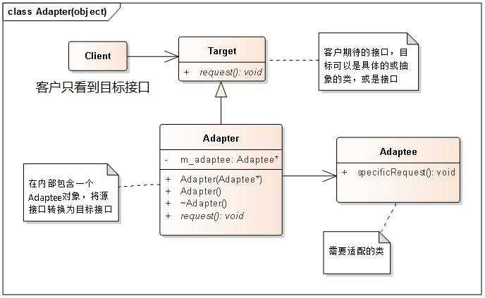
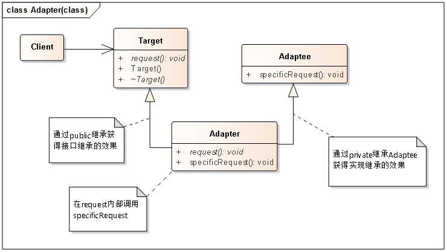
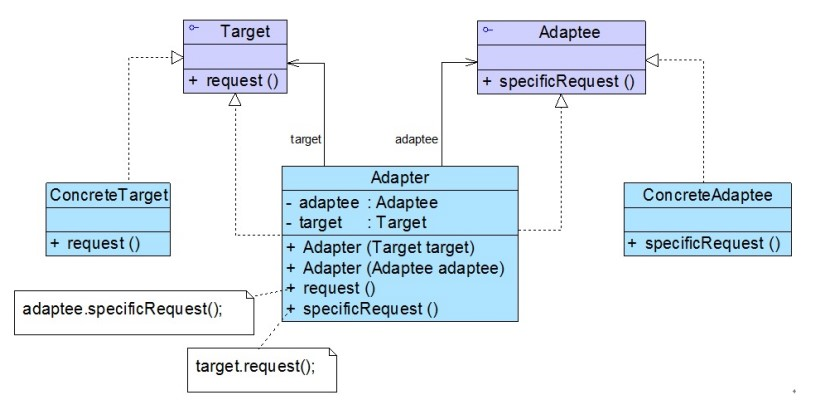
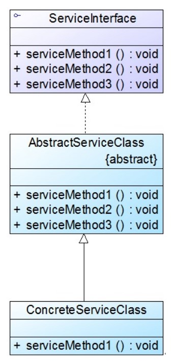

# 适配器模式

## 一、介绍

### 1.1 定义

适配器模式（Adapter Pattern）： 将一个类的接口，转换成客户期望的另一个接口。适配器让原本接口不兼容的类可以合作无间。

适配器模式既可以作为类结构型模式，也可以作为对象结构型模式。其别名为包装器（Wrapper）。

> 因为 Java 不支持多重继承的特性，文中如无特别说明，均表示对象适配器模式。

### 1.2 作用

适配器模式可以将现有接口转化为客户类所期望的接口，实现了对现有类的复用，它是一种使用频率非常高的设计模式，在软件开发中得以广泛应用，在 Spring 等开源框架、驱动程序设计（如 JDBC 中的数据库驱动程序）中也使用了适配器模式。

> 在适配器模式定义中所提及的接口是指广义的接口，它可以表示一个方法或者方法的集合。

> 如果需要一个适配器包装多个被适配者，需要使用外观模式（Facade Pattern）。

### 1.3 面向对象原则

1. 面向接口编程
2. 对象组合

### 1.3 使用场景

在以下情况下可以考虑使用适配器模式：

1. 系统需要使用一些现有的类，而这些类的接口（如方法名）不符合系统的需要，甚至没有这些类的源代码。

2. 想创建一个可以重复使用的类，用于与一些彼此之间没有太大关联的一些类，包括一些可能在将来引进的类一起工作。

### 1.4 优缺点

下面是适配器模式的共同优缺点。

#### 共同优点

1. 将目标类和适配者类解耦，通过引入一个适配器类来重用现有的适配者类，无须修改原有结构。

2. 增加了类的透明性和复用性，将具体的业务实现过程封装在适配者类中，对于客户端类而言是透明的，而且提高了适配者的复用性，同一个适配者类可以在多个不同的系统中复用。

3. 灵活性和扩展性都非常好，通过使用配置文件，可以很方便地更换适配器，也可以在不修改原有代码的基础上增加新的适配器类，完全符合 `开闭原则`。

#### 对象适配器模式的优点

对象适配器模式还有下面的优点：

1. 一个对象适配器可以把多个不同的适配者适配到同一个目标；

2. 可以适配一个适配者的子类，由于适配器和适配者之间是关联关系，根据 `里氏代换原则`，适配者的子类也可通过该适配器进行适配。

#### 类适配器模式的优点

1. `Adapter` 可以重定义 `Adaptee` 的部分行为。由于适配器类是被适配者的子类，因此可以在适配器类中置换一些适配者的方法，使得适配器的灵活性更强。

#### 对象适配器模式的缺点

1. 与类适配器模式相比，要在适配器中置换适配者类的某些方法比较麻烦。如果一定要置换掉适配者类的一个或多个方法，可以先做一个适配者类的子类，将适配者类的方法置换掉，然后再把适配者类的子类当做真正的适配者进行适配，实现过程较为复杂。

2. 过多地使用适配器会让系统非常零乱，不易整体进行把握。例如表面上调用的是 A 接口，实际上其内部被适配成 B 接口的实现。

3. 不能重定义被适配者 `Adaptee` 的行为。

#### 类适配器模式的缺点

1. 对于 Java、C# 等不支持多重类继承的语言，一次最多只能适配一个适配者类，不能同时适配多个适配者。

2. 被适配者类不能为最终类。如在 Java 中不能为 final 类，C# 中不能为 sealed 类。

3. 在 Java、C# 等语言中，类适配器模式中的目标抽象类只能为接口，不能为类，其使用有一定的局限性。

## 二、组成部分

### 1. 对象适配器模式

#### 1.1 UML 类图

#### 1.2 角色组成

在**对象适配器模式**结构图中包含如下几个角色：

- `Target（目标抽象类）` ：目标抽象类定义客户所需接口，可以是一个抽象类或接口，也可以是具体类。

- `Adapter（适配器类）`：适配器可以调用另一个接口，作为一个转换器，对 `Adaptee` 和 `Target` 进行适配，适配器类是适配器模式的核心，在对象适配器中，它通过继承Target并关联一个 `Adaptee` 对象使二者产生联系。

- `Adaptee（被适配者类）`：适配者即被适配的角色，它定义了一个已经存在的接口，这个接口需要适配，适配者类一般是一个具体类，包含了客户希望使用的业务方法，在某些情况下可能没有适配者类的源代码。

### 2 类适配器模式

#### 2.1 UML 类图

类适配器模式和对象适配器模式最大的区别在于：适配器和适配者之间的关系不同。对象适配器模式中适配器和适配者之间是**关联**关系（组合），而类适配器模式中适配器和适配者是**继承**关系。

由于 Java 中只支持单继承，所以不支持类适配器。

#### 2.2 角色组成

与对象适配器模式一致。

### 3 双向适配器

#### 3.1 UML 类图

如果在适配器中**同时包含**对目标类和适配者类的引用，适配者可以通过它调用目标类中的方法，目标类也可以通过它调用适配者类中的方法，那么该适配器就是一个双向适配器。

#### 3.2 角色组成

与对象适配器模式一致。

### 4 缺省适配器

#### 4.1 UML 类图

**缺省适配器模式(Default Adapter Pattern)**：当不需要实现一个接口所提供的所有方法时，可先设计一个抽象类实现该接口，并为接口中每个方法提供一个默认实现（空方法），那么该抽象类的子类可以选择性地覆盖父类的某些方法来实现需求，它适用于不想使用一个接口中的所有方法的情况，又称为单接口适配器模式。

> 这个抽象类就是一个抽象的骨架实现类。

#### 4.2 角色组成

在缺省适配器模式中，包含如下三个角色：

- `ServiceInterface（适配者接口）`：它是一个接口，通常在该接口中声明了大量的方法。

- `AbstractServiceClass（缺省适配器类）`：它是缺省适配器模式的核心类，使用空方法的形式实现了在ServiceInterface接口中声明的方法。通常将它定义为抽象类，因为对它进行实例化没有任何意义。

- `ConcreteServiceClass（具体业务类）`：它是缺省适配器类的子类，在没有引入适配器之前，它需要实现适配者接口，因此需要实现在适配者接口中定义的所有方法，而对于一些无须使用的方法也不得不提供空实现。在有了缺省适配器之后，可以直接继承该适配器类，根据需要有选择性地覆盖在适配器类中定义的方法。

> 在JDK类库的事件处理包 `java.awt.event` 中广泛使用了缺省适配器模式，如 `WindowAdapter`、`KeyAdapter`、`MouseAdapter` 等。

## 三、示例

Rocketstar 软件公司欲开发一款第三人称射击游戏，该游戏系统中需要提供一个加密模块，将用户机密信息（如口令、邮箱等） 加密之后再存储在数据库中，系统已经定义好了数据库操作类。为了提高开发效率，现需要重用已有的加密算法，这些算法封装在一些由第三方提供的类中，有些甚至没有源代码。试使用适配器模式设计该加密模块，实现在不修改现有类的基础上重用第三方加密方法。

完整代码：[https://github.com/HasonHuang/java-design-patterns/tree/master/adapter-pattern](https://github.com/HasonHuang/java-design-patterns/tree/master/adapter-pattern)

### 3.1 目标抽象类

- `com.hason.patterns.adapter.Aead`

### 3.2 适配器类

- `com.hason.patterns.adapter.Base64Adapter`

### 3.3 被适配者类

- `com.hason.patterns.adapter.thirdpart.Base64`

## 参考资料

1. 《Head First 设计模式》

2. [设计模式](http://gof.quanke.name/)