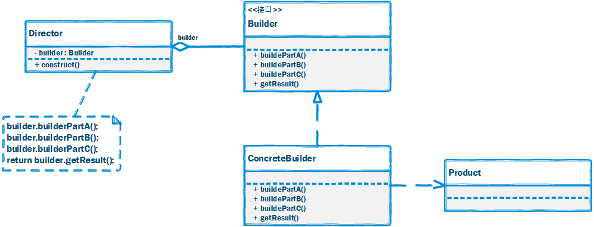

# 建造者模式

## 一、介绍

### 1.1 定义

**建造者模式（Builder Pattern）**： 将一个复杂对象的构建与它的表示分离，使得同样的构建过程可以创建不同的表示。建造者模式是一种对象创建型模式。

原型模式是一种对象创建型模式。

### 1.2 作用

封装一个产品的构造过程，并允许按步骤构造。

### 1.3 面向对象原则

1. 里氏替换原则
2. 单一职责原则
3. 开闭原则

### 1.3 使用场景

以下情况下可以考虑使用建造者模式：

1. 需要生成的产品对象有复杂的内部结构，这些产品对象通常包含多个成员属性。

2. 需要生成的产品对象的属性相互依赖，需要指定其生成顺序。

3. 对象的创建过程独立于创建该对象的类。

  在建造者模式中通过引入了指挥者类，将创建过程封装在指挥者类中，而不在建造者类和客户类中。

4. 隔离复杂对象的创建和使用，并使得相同的创建过程可以创建不同的产品。

> 与工厂方法模式不同的是，建造者模式关注的是产品的零件类型和装配工艺（顺序）。

> 在使用建造者模式的时候，考虑一下**模板方法模式**，不要孤立地思考一个模式，僵化地套用一个模式会让你受害无穷！

### 1.4 优缺点

#### 优点

1. 将一个复杂对象的创建过程封装起来。

2. 允许对象通过多个步骤来创建，并且可以改变过程（这和只有一个步骤的工厂模式不同）。

3. 向客户隐藏产品内部的表现。

4. 产品的实现可以被替换，因为客户只看到一个抽象的接口。

#### 缺点

1. 如果产品之间的差异性很大，不适合使用建造者模式，因此其使用范围受到一定的限制。

2. 与工厂模式相比，采用生成器模式创建对象的客户，需要具备更多的领域知识。

## 二、组成部分

### 2.1 UML 类图



### 2.2 角色组成

建造者模式包含如下几个角色：

- `Builder（抽象建造者）`：它为创建一个产品Product对象的各个部件指定抽象接口，在该接口中一般声明两类方法：

  - `buildPartX()` 用于创建复杂对象的各个部件；
  
  - `getResult()` 用于返回复杂对象。`Builder` 既可以是抽象类，也可以是接口。

- `ConcreteBuilder（具体建造者）`：它实现了 `Builder` 接口，实现各个部件的具体构造和装配方法，定义并明确它所创建的复杂对象，也可以提供一个方法返回创建好的复杂产品对象。

- `Product（产品角色）`：它是被构建的复杂对象，包含多个组成部件，具体建造者创建该产品的内部表示并定义它的装配过程。

- `Director（指挥者）`：指挥者又称为导演类，它负责安排复杂对象的建造次序，指挥者与抽象建造者之间存在关联关系，可以在其 `construct()` 建造方法中调用建造者对象的部件构造与装配方法，完成复杂对象的建造。客户端一般只需要与指挥者进行交互，在客户端确定具体建造者的类型，并实例化具体建造者对象（也可以通过配置文件和反射机制），然后通过指挥者类的构造函数或者 Setter 方法将该对象传入指挥者类中。

### 2.3 `Director` 指挥者

指挥者类 `Director` 在建造者模式中扮演非常重要的作用，简单的 `Director` 类用于指导具体建造者**如何构建产品**，它**按一定次序调用** `Builder` 的 `buildPartX()` 方法，控制调用的先后次序，并向客户端返回一个完整的产品对象。下面我们讨论几种 `Director` 的高级应用方式：

#### 1. 省略 Director

为了简化系统结构，可以将 `Director` 和抽象建造者 `Builder` 进行合并，在 `Builder` 中提供逐步构建复杂产品对象的 `construct()` 方法。

代码如下：

```java
abstract class ProductBuilder {
    protected static Product product = new Product();

    public abstract void buildType();
    public abstract void buildSex();
    public abstract void buildFace();
    public abstract void buildCostume();
    public abstract void buildHairstyle();

    public static Product construct(ProductBuilder ab) {
        // 具体 Builder 里的 buildeXXX 方法
        // 直接调用 product.setXXX 赋值
        ab.buildType();
        ab.buildSex();
        ab.buildFace();
        ab.buildCostume();
        ab.buildHairstyle();
        return product;
    }
}
```

客户端代码：

```java
ProductBuilder builder = new ProductBuilder();
Product product = ProductBuilder.construct(builder);
```

还可以将 `constrct()` 方法的参数去掉。省略 `Director` 不影响系统的灵活性和可扩展性，同时还简化了系统结构，但加重了抽象建造者类的职责。

如果construct()方法较为复杂，待构建产品的组成部分较多，建议还是将construct()方法单独封装在Director中，这样做更符合“单一职责原则”。

#### 2. 钩子方法的引入

建造者模式除了逐步构建一个复杂产品对象外，还可以通过 `Director` 类来更加精细地控制产品的创建过程，例如增加一类称之为`钩子方法(HookMethod)`的特殊方法来控制是否对某个 buildPartX() 的调用。

```java
abstract class ProductBuilder {
    protected static Product product = new Product();

    public abstract void buildType();
    public abstract void buildSex();
    public abstract void buildFace();
    public abstract void buildCostume();
    public abstract void buildHairstyle();

    // 钩子方法
    public boolean isBareheaded() {
        return false;
    }

    public static Product construct(ProductBuilder ab) {
        // 具体 Builder 里的 buildeXXX 方法
        // 直接调用 product.setXXX 赋值
        ab.buildType();
        ab.buildSex();
        ab.buildFace();
        ab.buildCostume();
        ab.buildHairstyle();
        return product;
    }
}
```

指挥者的代码：

```java
class ProductDirector {
    public Product construct(ProductBuilder builder) {
        builder.buildType();
        builder.buildSex();
        builder.buildFace();
        builder.buildCostume();
        // 通过钩子方法来控制产品的构建
        if (!builder.isBareheaded()) {
            builder.buildHairstyle();
        }
        return builder.createProduct();
    }
}
```

## 三、示例

Rocketstar 软件公司欲开发一款第三人称射击游戏，该游戏系统里的人物造型包含发型、衣服、首饰、枪支等元素，玩家都可以自定义这些元素。现要求在玩家配置完点击“确认”按钮后，按固定顺序生成人物造型。

完整代码：[https://github.com/HasonHuang/java-design-patterns/tree/master/builder-pattern](https://github.com/HasonHuang/java-design-patterns/tree/master/builder-pattern)

### 3.1 产品角色

- `com.hason.patterns.builder.Model`

### 3.2 抽象建造者

- `com.hason.patterns.builder.ModelBuilder`

### 3.3 具体建造者

- `com.hason.patterns.builder.SpringModelBuilder`
- `com.hason.patterns.builder.WinterModelBuilder`

### 3.4 指挥者

- `com.hason.patterns.builder.ModelBuilderDirector`

## 参考资料

1.  《Head First 设计模式》

2.  [设计模式](http://gof.quanke.name/)


