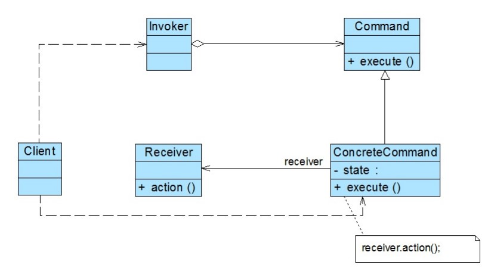

# 命令模式

## 一、介绍

### 1.1 定义

命令模式（Command Pattern）： 将“请求”封装成对象，以便使用不同的请求、队列或者日志来参数化其他对象。命令模式也支持可撤销的操作。

命令模式是一种对象行为型模式，其别名为动作(Action)模式或事务(Transaction)模式。

### 1.2 作用

命令模式是一种使用频率非常高的设计模式，它可以将请求发送者与接收者解耦，请求发送者通过命令对象来间接引用请求接收者，使得系统具有更好的灵活性和可扩展性。

### 1.3 面向对象原则

1. 开闭原则
2. 面向接口编程
3. 多用组合

### 1.3 使用场景

在以下情况下可以考虑使用命令模式：

1. 系统需要将请求调用者和请求接收者解耦，使得调用者和接收者不直接交互。请求调用者无须知道接收者的存在，也无须知道接收者是谁，接收者也无须关心何时被调用。

2. 系统需要在不同的时间指定请求、将请求排队和执行请求。一个命令对象和请求的初始调用者可以有不同的生命期，换言之，最初的请求发出者可能已经不在了，而命令对象本身仍然是活动的，可以通过该命令对象去调用请求接收者，而无须关心请求调用者的存在性，可以通过请求日志文件等机制来具体实现。

3. 系统需要支持命令的撤销(Undo)操作和恢复(Redo)操作。

4. 系统需要将一组操作组合在一起形成宏命令。

### 1.4 优缺点

优点：

1. 降低系统的耦合度。由于请求者与接收者之间不存在直接引用，因此请求者与接收者之间实现完全解耦，相同的请求者可以对应不同的接收者，同样，相同的接收者也可以供不同的请求者使用，两者之间具有良好的独立性。

2. 新的命令可以很容易地加入到系统中。由于增加新的具体命令类不会影响到其他类，因此增加新的具体命令类很容易，无须修改原有系统源代码，甚至客户类代码，满足“开闭原则”的要求。

3. 可以比较容易地设计一个命令队列或宏命令（ 组合命令） 。

4. 为请求的撤销(Undo)和恢复(Redo)操作提供了一种设计和实现方案。

缺点：

1. 使用命令模式可能会导致某些系统有过多的具体命令类。因为针对每一个对请求接收者的调用操作都需要设计一个具体命令类，因此在某些系统中可能需要提供大量的具体命令类，这将影响命令模式的使用。

## 二、组成部分

### 2.1 UML 类图

### 2.2 角色组成

- `Command（抽象命令类）`：抽象命令类一般是一个抽象类或接口，在其中声明了用于执行请求的 `execute()` 等方法，通过这些方法可以调用请求接收者的相关操作。

- `ConcreteCommand（具体命令类）`：具体命令类是抽象命令类的子类，实现了在抽象命令类中声明的方法，它对应具体的接收者对象，将接收者对象的动作绑定其中。在实现 `execute()` 方法时，将调用接收者对象的相关操作(Action)。

- `Invoker（调用者）`：调用者即请求发送者，它通过命令对象来执行请求。**一个调用者并不需要在设计时确定其接收者，因此它只与抽象命令类之间存在关联关系**。在程序运行时可以将一个具体命令对象注入其中，再调用具体命令对象的 `execute()` 方法，从而实现间接调用请求接收者的相关操作。

- `Receiver（接收者）`：接收者执行与请求相关的操作，它具体实现对请求的业务处理。

命令模式的关键在于引入了**抽象命令类**，请求发送者针对**抽象命令类**编程，只有实现了抽象命令类的具体命令才与请求接收者相关联。在最简单的抽象命令类中只包含了一个抽象的 `execute()` 方法，每个具体命令类将一个 `Receiver` 类型的对象作为一个实例变量进行存储，从而具体指定一个请求的接收者，不同的具体命令类提供了 `execute()` 方法的不同实现，并调用不同接收者的请求处理方法。

### 2.3 宏命令

`宏命令(Macro Command)`又称为组合命令，它是**组合模式和命令模式联用的产物**。宏命令是一个具体命令类，它拥有一个集合属性，在该集合中包含了对其他命令对象的引用。通常宏命令不直接与请求接收者交互，而是通过它的成员来调用接收者的方法。当调用宏命令的 `execute()` 方法时，将递归调用它所包含的每个成员命令的 `execute()` 方法，一个宏命令的成员可以是简单命令，还可以继续是宏命令。执行一个宏命令将触发多个具体命令的执行，从而实现对命令的批处理，其结构如图所示：

## 三、示例

Rocketstar 软件公司欲开发一款第三人称射击游戏，该游戏系统中的用户可以发送任何命令，包括射击、投弹等等。此时需要一个统一的命令对象封装用户的各种操作指令，从而令代表玩家的 Player 仅需在获得指令后调用执行方法。

完整代码：[https://github.com/HasonHuang/java-design-patterns/tree/master/command-pattern](https://github.com/HasonHuang/java-design-patterns/tree/master/command-pattern)

### 3.1 抽象命令类

- `com.hason.patterns.command.command.Command`

### 3.2 具体命令类

- `com.hason.patterns.command.command.KnifeCommand`

- `com.hason.patterns.command.command.SignalBombCommand`

### 3.3 调用者

- `com.hason.patterns.command.Player`

### 3.4 接收者

- `com.hason.patterns.command.receiver.Knife`
- `com.hason.patterns.command.receiver.Map`
- `com.hason.patterns.command.receiver.SignalBomb`

### 3.5 宏命令

射击游戏中，往往需要这样一个命令——当玩家发送一个操作指令后，服务器端能执行多个操作，以便玩家能快速联系队友，提高游戏体验。比如扔出信号弹后，同时在队友的地图中显示求救信号。

- `com.hason.patterns.command.command.SignalBombCommand`

## 参考资料

1. 《Head First 设计模式》

2. [设计模式](http://gof.quanke.name/)
