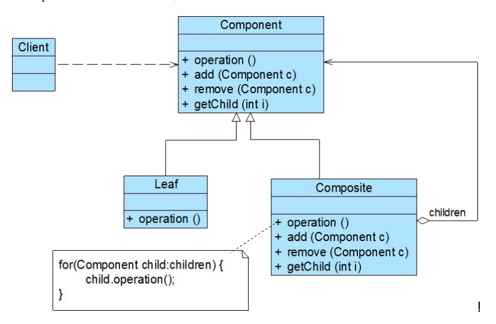
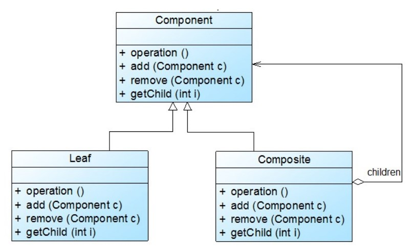
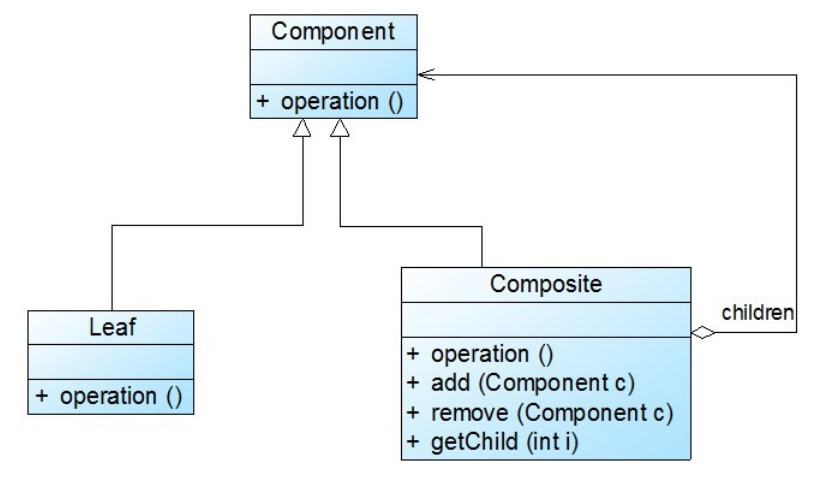

# 组合模式

## 一、介绍

### 1.1 定义

**组合模式（Composite Pattern）**： 允许你将对象组合成树形结构来表现“整体/部分”层次结构。组合能让客户以一致的方式处理个别对象以及对象组合。

组合模式又可以称为“整体—部分”(Part-Whole)模式，它是一种对象结构型模式。

### 1.2 作用

组合模式使用面向对象的思想来实现**树形结构**的构建与处理，描述了如何将容器对象和叶子对象进行递归组合，实现简单，灵活性好。

### 1.3 面向对象原则

1. 开闭原则
2. 单一职责原则
3. 面向接口编程

### 1.3 使用场景

在以下情况下可以考虑使用组合模式：

1. 在具有整体和部分的层次结构中，希望通过一种方式忽略整体与部分的差异，客户端可以一致地对待它们。

2. 在一个使用面向对象语言开发的系统中需要处理一个树形结构。

3. 在一个系统中能够分离出叶子对象和容器对象，而且它们的类型不固定，需要增加一些新的类型。

### 1.4 优缺点

优点：

1. 组合模式可以清楚地定义分层次的复杂对象，表示对象的全部或部分层次，它让客户端忽略了层次的差异，方便对整个层次结构进行控制。

2. 客户端可以一致地使用一个组合结构或其中单个对象，不必关心处理的是单个对象还是整个组合结构，简化了客户端代码。

3. 在组合模式中增加新的容器组件和叶子组件都很方便，无须对现有类库进行任何修改，符合`开闭原则`。

4. 组合模式为树形结构的面向对象实现提供了一种灵活的解决方案，通过叶子对象和容器对象的递归组合，可以形成复杂的树形结构，但对树形结构的控制却非常简单。

缺点：

1. 在增加新组件时很难对容器中的组件类型进行限制。有时候我们希望一个容器中只能有某些特定类型的对象，例如在某个文件夹中只能包含文本文件，使用组合模式时，不能依赖类型系统来施加这些约束，因为它们都来自于相同的抽象层，在这种情况下，必须通过在运行时进行类型检查来实现，这个实现过程较为复杂。

## 二、组成部分

### 2.1 UML 类图

### 2.2 角色组成

组合模式包含如下几个角色：

- `Component（抽象组件）`：它可以是接口或抽象类，为叶子组件和容器组件对象声明接口，在该角色中可以包含所有子类共有行为的声明和实现。在抽象组件中定义了访问及管理它的子组件的方法，如增加子组件、删除子组件、获取子组件等。

- `Leaf（叶子组件）`：它在组合结构中表示叶子节点对象，叶子节点没有子节点，它实现了在抽象组件中定义的行为。对于那些访问及管理子组件的方法，可以通过异常等方式进行处理。

- `Composite（容器组件）`：它在组合结构中表示容器节点对象，容器节点包含子节点，其子节点可以是叶子节点，也可以是容器节点，它提供一个集合用于存储子节点，实现了在抽象组件中定义的行为，包括那些访问及管理子组件的方法，在其业务方法中可以递归调用其子节点的业务方法。

组合模式的关键是定义了一个`抽象组件类`，它既可以代表`叶子`，又可以代表`容器`，而客户端针对该抽象组件类进行编程，无须知道它到底表示的是叶子还是容器，可以对其进行统一处理。同时容器对象与抽象组件类之间还建立一个**聚合关联**关系，在容器对象中既可以包含叶子，也可以包含容器，以此实现递归组合，形成一个树形结构。

在使用组合模式时，根据抽象组件类的定义形式，我们可将组合模式分为**透明组合模式**和**安全组合模式**两种形式。

### 2.3 透明组合模式

透明组合模式中，抽象组件 `Component` 中声明了所有用于管理成员对象的方法，包括 `add()`、`remove()` 以及 `getChild()` 等方法，这样做的好处是确保所有的组件类都有相同的接口。在客户端看来，叶子对象与容器对象所提供的方法是一致的，客户端可以相同地对待所有的对象。透明组合模式也是组合模式的**标准形式**。

透明组合模式的**缺点是不够安全**，因为叶子对象和容器对象在本质上是有区别的。叶子对象不可能有下一个层次的对象，即不可能包含成员对象，因此为其提供 `add()`、`remove()` 以及 `getChild()` 等方法是没有意义的，这在编译阶段不会出错，但在运行阶段如果调用这些方法可能会出错（如果没有提供相应的错误处理代码）。

### 2.4 安全组合模式

安全组合模式中，在抽象组件 `Component` 中没有声明任何用于管理成员对象的方法，而是在 `Composite` 类中声明并实现这些方法。这种做法是安全的，因为根本不向叶子对象提供这些管理成员对象的方法，对于叶子对象，客户端不可能调用到这些方法。结构如下图：

安全组合模式的**缺点是不够透明**，因为叶子组件和容器组件具有不同的方法，且容器组件中那些用于管理成员对象的方法没有在抽象组件类中定义，因此客户端不能完全针对抽象编程，**必须有区别地对待叶子组件和容器组件**。在实际应用中，安全组合模式的**使用频率也非常高**，在 Java AW T中使用的组合模式就是安全组合模式。

## 三、示例

Rocketstar 软件公司欲开发一款第三人称射击游戏，该游戏系统经常运行各种任务，而每个复杂任务里包含许多子任务。现在需要根据组合模式设计一套任务模块，能让各个独立、微小任务能否轻易地组合在一起并按顺序运行。

完整代码：[https://github.com/HasonHuang/java-design-patterns/tree/master/composite-pattern](https://github.com/HasonHuang/java-design-patterns/tree/master/composite-pattern)

### 3.1 抽象组件

- `com.hason.patterns.composite.Task`

### 3.2 叶子组件

- `com.hason.patterns.composite.FileTask`
- `com.hason.patterns.composite.JsonParseTask`
- `com.hason.patterns.composite.XmlParseTask`

### 3.3 容器组件

- `com.hason.patterns.composite.CompositeTask`

## 参考资料

1.  《Head First 设计模式》

2.  [设计模式](http://gof.quanke.name/)

