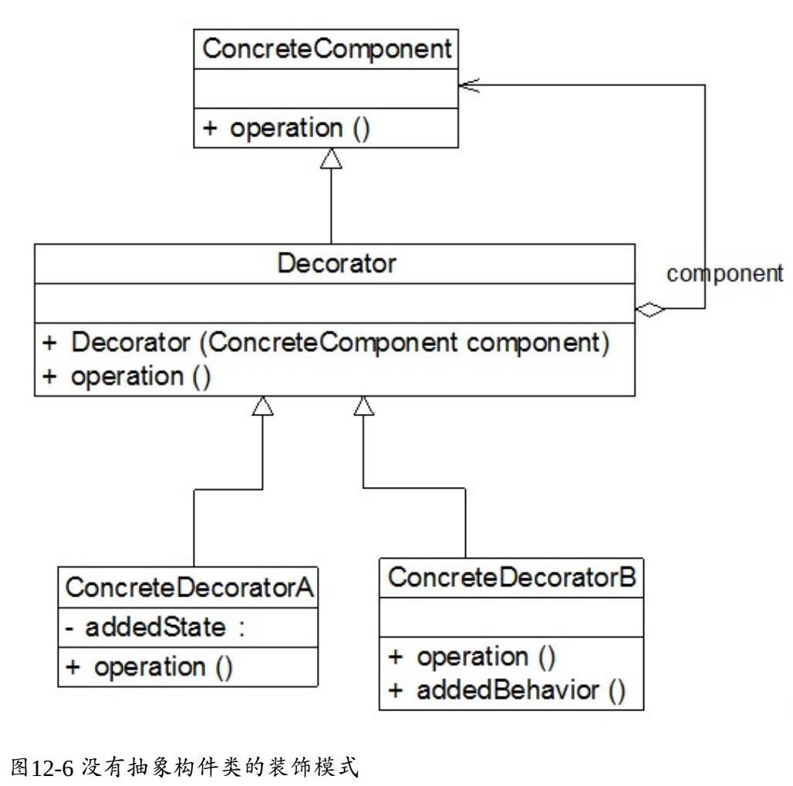
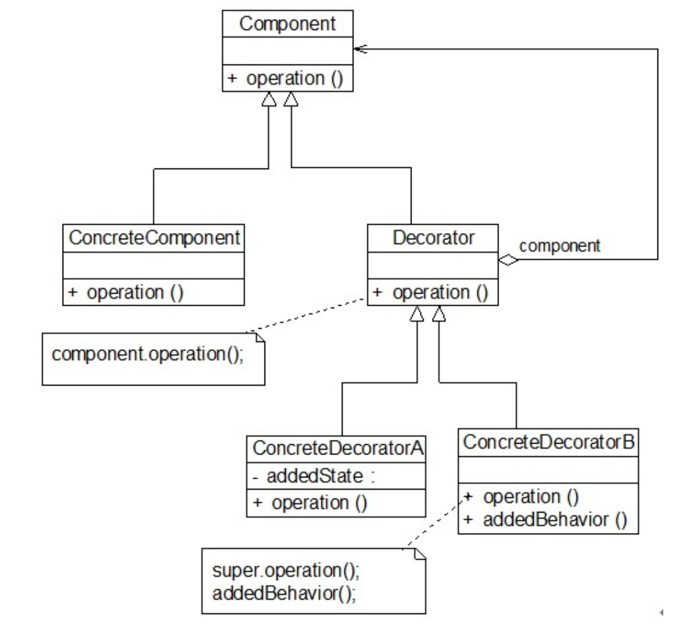

# 装饰者模式

## 一、介绍

### 1.1 定义

装饰者模式（Decorator Pattern）：动态地将责任附加到对象上。若要扩展功能，装饰者提供了比继承更有弹性的替代方案。

> decorator 英式发音 [ˈdekəreɪtə(r)]

### 1.2 作用

降低了系统的耦合度，可以动态增加或删除对象的职责，并使得需要装饰的具体组件类和具体装饰类可以独立变化，以便增加新的具体组件类和具体装饰类。

### 1.3 使用场景

在以下情况下可以考虑使用装饰者模式：

1. 在不影响其他对象的情况下，以动态、透明的方式给单个对象添加职责。

2. 当不能采用继承的方式对系统进行扩展或者采用继承不利于系统扩展和维护时可以使用装饰模式。不能采用继承的情况主要有两类：
  1. 第一类是系统中存在大量独立的扩展，为支持每一种扩展或者扩展之间的组合将产生大量的子类，使得子类数目呈爆炸性增长；
  2. 第二类是因为类已定义为不能被继承（ 如Java语言中的final类） 。

### 1.4 面向对象原则

1.  开放-关闭原则————类应该对扩展开放，对修改关闭。

### 1.5 优缺点

优点：

1. 对于扩展一个对象的功能，装饰模式比继承更加灵活性，不会导致类的个数急剧增加。

2. 可以通过一种动态的方式来扩展一个对象的功能，通过配置文件可以在运行时选择不同的具体装饰类，从而实现不同的行为。

3. 可以对一个对象进行多次装饰，通过使用不同的具体装饰类以及这些装饰类的排列组合，可以创造出很多不同行为的组合，得到功能更为强大的对象。

4. 具体组件类与具体装饰类可以独立变化，用户可以根据需要增加新的具体组件类和具体装饰类，原有类库代码无须改变，符合“开闭原则”。

缺点：

1. 使用装饰模式进行系统设计时将产生很多小对象，这些对象的区别在于它们之间相互连接的方式有所不同，而不是它们的类或者属性值有所不同，大量小对象的产生势必会占用更多的系统资源，在一定程序上影响程序的性能。

2. 装饰模式提供了一种比继承更加灵活机动的解决方案，但同时也意味着比继承更加易于出错，排错也很困难，对于多次装饰的对象，调试时寻找错误可能需要逐级排查，较为繁琐。

### 1.6 注意事项

1. 尽量保持装饰类的接口与被装饰类的接口相同，这样，对于客户端而言，无论是装饰之前的对象还是装饰之后的对象都可以一致对待。这也就是说，在可能的情况下，我们应该尽量使用透明装饰模式。

2. 尽量保持具体组件类 `ConcreteComponent` 是一个“轻”类，也就是说不要把太多的行为放在具体组件类中，我们可以通过装饰类对其进行扩展。

3. 如果只有一个具体组件类，那么抽象装饰类可以作为该具体组件类的直接子类。

  

## 二、组成部分

### 2.1 UML 类图



### 2.2 角色组成

- `Component（抽象组件）`：它是具体组件和抽象装饰类的共同父类，声明了在具体组件中实现的业务方法，它的引入可以使客户端以一致的方式处理未被装饰的对象以及装饰之后的对象，实现客户端的透明操作。

- `ConcreteComponent（具体组件）`：它是抽象组件类的子类，用于定义具体的组件对象，实现了在抽象组件中声明的方法，装饰器可以给它增加额外的职责（方法）。

- `Decorator（抽象装饰类）`：它也是抽象组件类的子类，用于给具体组件增加职责，但是具体职责在其子类中实现。它维护一个指向抽象组件对象的引用，通过该引用可以调用装饰之前组件对象的方法，并通过其子类扩展该方法，以达到装饰的目的。

- `ConcreteDecorator（具体装饰类）`：它是抽象装饰类的子类，负责向组件添加新的职责。每一个具体装饰类都定义了一些新的行为，它可以调用在抽象装饰类中定义的方法，并可以增加新的方法用以扩充对象的行为。

### 2.3 透明装饰者模式与半透明装饰者模式


#### 2.3.1 透明装饰者模式

要求客户端完全针对抽象编程，装饰模式的透明性要求客户端程序不应该将对象声明为具体组件类型或具体装饰类型，而应该全部声明为抽象组件类型。对于客户端而言，具体组件对象和具体装饰对象没有任何区别。也就是应该使用如下代码：

```java
// 使用抽象组件类型定义对象
Component c new ConcreteComponent();
Component c1 new ConcreteDecorator (c);
// 而不应该使用如下代码：
// 使用具体组件类型定义对象
ConcreteComponent c = new ConcreteComponent();
// 或使用具体装饰类型定义对象
ConcreteDecorator c1 = new ConcreteDecorator(c);
```

#### 2.3.2 半透明装饰者模式

**透明装饰模式**的设计难度较大，而且有时我们需要单独调用新增的业务方法。为了能够**调用到新增方法**，我们不得不用具体装饰类型来定义装饰之后的对象，而具体组件类型还是可以使用抽象组件类型来定义，这种装饰模式即为**半透明装饰模式**。

也就是说，对于客户端而言，具体组件类型无须关心，是透明的；但是具体装饰类型必须指定，这是不透明的。

如文件对象功能增加实例，为了能够调用到在 `Approver` 中新增方法 `approve()`，客户端代码片段如下所示：

```java
//使用抽象组件类型定义
Document doc = new PurchaseRequest();
//使用具体装饰类型定义
Approver newDoc = new Approver(doc);
```

半透明装饰模式可以给系统带来更多的灵活性，设计相对简单，使用起来也非常方便；但是其**最大的缺点在于不能实现对同一个对象的多次装饰**，而且客户端需要有区别地对待装饰之前的对象和装饰之后的对象。

> 因为在半透明装饰模式中，使用具体装饰类来声明装饰之后的对象，具体装饰类中**新增的方法并未在抽象组件类中声明**，这样做的优点在于装饰后客户端可以单独调用在具体装饰类中新增的业务方法，但是将导致无法调用到之前装饰时新增的方法，**只能调用到最后一次装饰时具体装饰类中新增加的方法**，故对同一个对象实施多次装饰没有任何意义。

## 三、示例

Rocketstar 软件公司欲开发一款第三人称射击游戏，该游戏需提供如下功能：系统提供个性化道具，如果玩家需要个性化形象，可以购买发型、服装、饰物等道具穿戴。系统允许自定义的道具搭配。

### 3.1 抽象组件

```java
/**
 * 游戏道具（抽象组件）
 *
 * @author Huanghs
 * @since 2.0
 * @date 2018/12/25
 */
public interface Prop {

    /**
     * 获取道具名字
     */
    String name();

    /**
     * 获取道具价格
     */
    BigDecimal cost();

}
```

### 3.2 具体组件

```java
/**
 * 发型道具（具体组件）
 *
 * @author Huanghs
 * @since 2.0
 * @date 2018/12/25
 */
@AllArgsConstructor
public class HairProp implements Prop {

    /** 道具名 */
    private String name;
    /** 价格 */
    private BigDecimal price;

    @Override
    public String name() {
        return name;
    }

    @Override
    public BigDecimal cost() {
        return price;
    }
}
```

### 3.3 抽象装饰者

```java
/**
 * 道具装饰类（抽象装饰类）
 *
 * @author Huanghs
 * @since 2.0
 * @date 2018/12/25
 */
@AllArgsConstructor
public abstract class PropDecorator implements Prop {

    @Getter
    private Prop prop;

}
```

### 3.3 具体装饰类

```java
/**
 * 颜色装饰器（具体装饰类）
 *
 * @author Huanghs
 * @since 2.0
 * @date 2018/12/25
 */
public class ColorDecorator extends PropDecorator {

    public ColorDecorator(Prop prop) {
        super(prop);
    }

    @Override
    public String name() {
        return "绿色的" + getProp().name();
    }

    @Override
    public BigDecimal cost() {
        // 绿色价格 + 发型价格
        return new BigDecimal("888.88").add(getProp().cost());
    }
}
```

```java
/**
 * 品牌装饰类（具体装饰类）
 *
 * @author Huanghs
 * @since 2.0
 * @date 2018/12/25
 */
public class GucciDecorator extends PropDecorator {

    public GucciDecorator(Prop prop) {
        super(prop);
    }

    @Override
    public String name() {
        return "Gucci's " + getProp().name();
    }

    @Override
    public BigDecimal cost() {
        return new BigDecimal("6.6").add(getProp().cost());
    }
}
```

### 3.4 使用模式

```java
/**
 * 游戏客户端
 *
 * @author Huanghs
 * @since 2.0
 * @date 2018/12/25
 */
public class GameDemo {

    public static void main(String[] args) {
        // 玩家进入游戏购买道具
        // 透明装饰者模式
        Prop hair = new HairProp("A发型", BigDecimal.ONE);
        System.out.println(String.format("购买【%s】花费了【%s】", hair.name(), hair.cost()));
        hair = new ColorDecorator(hair);
        System.out.println(String.format("购买【%s】花费了【%s】", hair.name(), hair.cost()));
        hair = new GucciDecorator(hair);
        System.out.println(String.format("购买【%s】花费了【%s】", hair.name(), hair.cost()));
    }

}
```
