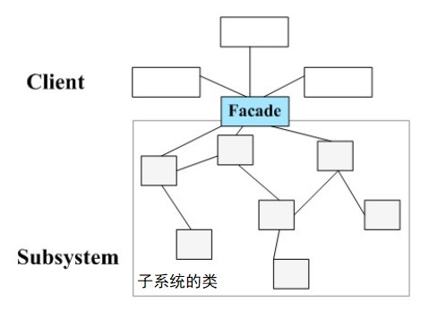
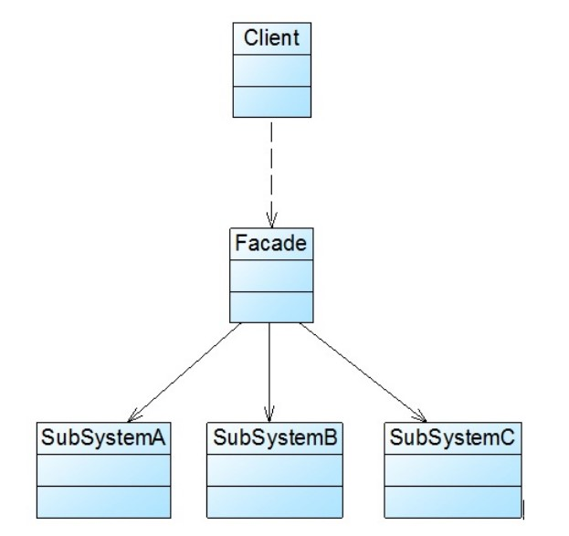

# 外观模式

## 一、介绍

### 1.1 定义

**外观模式（Facade Pattern）**： 提供了一个统一的接口，用来访问子系统中的一群接口。外观定义了一个高层接口，让子系统更容易使用。

外观模式又称为门面模式，它是一种对象结构型模式。

### 1.2 作用

外观模式是一种使用频率非常高的设计模式，它通过引入一个外观角色来简化客户端与子系统之间的交互，为复杂的子系统调用提供一个统一的入口，使子系统与客户端的耦合度降低，且客户端调用非常方便。外观模式并不给系统增加任何新功能，它仅仅是简化调用接口。

### 1.3 面向对象原则

1. 开闭原则
2. 面向接口编程
3. 多用组合
4. 最少知识原则

### 1.3 使用场景

在以下情况下可以考虑使用外观模式：

1. 当要为访问一系列复杂的子系统提供一个简单入口时可以使用外观模式。
2. 客户端程序与多个子系统之间存在很大的依赖性。引入外观类可以将子系统与客户端解耦，从而提高子系统的独立性和可移植性。
3. 在层次化结构中，可以使用外观模式定义系统中每一层的入口，层与层之间不直接产生联系，而通过外观类建立联系，降低层之间的耦合度。

### 1.4 优缺点

优点：

1. 它对客户端屏蔽了子系统组件，减少了客户端所需处理的对象数目，并使得子系统使用起来更加容易。
2. 它实现了子系统与客户端之间的松耦合关系，这使得子系统的变化不会影响到调用它的客户端，只需要调整外观类即可。
3. 一个子系统的修改对其他子系统没有任何影响，而且子系统内部变化也不会影响到外观对象。

缺点：

1. 不能很好地限制客户端直接使用子系统类，如果对客户端访问子系统类做太多的限制则减少了可变性和灵活性。
2. 如果设计不当，增加新的子系统可能需要修改外观类的源代码，违背了开闭原则。

## 二、组成部分

### 2.1 UML 类图

外观模式没有一个一般化的类图描述，通常使用下面的示意图来表示外观模式。

### 2.2 角色组成

外观模式包含如下两个角色：

- `Facade（外观角色）`：在客户端可以调用它的方法，在外观角色中可以知道相关的（一个或者多个） 子系统的功能和责任；在正常情况下，它将所有从客户端发来的请求委派到相应的子系统去，传递给相应的子系统对象处理。**外观角色可以是抽象外观类，更易于遵守开闭原则**。
- `SubSystem（子系统角色）`：在软件系统中可以有一个或者多个子系统角色，每一个子系统可以不是一个单独的类，而是一个类的集合，它实现子系统的功能；每一个子系统都可以被客户端直接调用，或者被外观角色调用，它处理由外观类传过来的请求；子系统并不知道外观的存在，对于子系统而言，外观角色仅仅是另外一个客户端而已。

> `子系统`是一个广义的概念，它可以是一个类、一个功能模块、系统的一个组成部分或者一个完整的系统。子系统类通常是一些业务类，实现了一些具体的、独立的业务功能。

## 三、示例

Rocketstar 软件公司欲开发一款第三人称射击游戏，该游戏系统在运行时需要读取用户机密信息，然后修改并保存起来，具体流程大概是：读取源文件、修改内容、保存到源文件；每一个流程对应的模块系统相对独立，现在需要设计一个更符合单一职责原则的类封装这些模块，令其更易使用。

完整代码：<https://github.com/HasonHuang/java-design-patterns/tree/master/facade-pattern>

### 3.1 抽象外观类

- `com.hason.patterns.facade.Facade`

### 3.2 具体外观类

- `com.hason.patterns.facade.EncryptorFacade`

### 3.3 子系统

- `com.hason.patterns.facade.subsystem.FileInputSystem`
- `com.hason.patterns.facade.subsystem.FileOutputSystem`
- `com.hason.patterns.facade.subsystem.UserInfoOperateSystem`

## 参考资料

1. 《Head First 设计模式》
2. [设计模式](http://gof.quanke.name/)