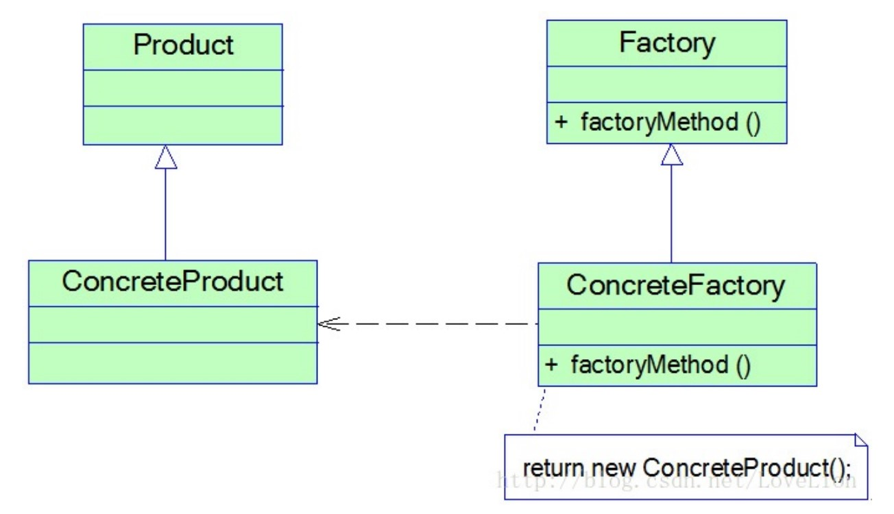

# 工厂方法模式

## 一、介绍

### 1.1 定义

工厂方法模式（Factory Method Pattern）： 定义了一个创建对象的接口，但由子类决定要实例化的类是哪一个。工厂方法让类把实例化推迟到子类。

> “决定”并不是指模式允许子类本身在运行时做决定，而是指在便携创建者类时，不需要知道实际创建的产品是哪一个。

工厂方法模式又简称为工厂模式(Factory Pattern)，又可称作虚拟构造器模式(Virtual Constructor Pattern)或多态工厂模式(Polymorphic Factory Pattern)。工厂方法模式是一种类创建型模式。

### 1.2 作用

工厂方法模式继承了简单工厂模式的优点，同时还弥补了简单工厂模式的不足。

> 工厂方法模式是使用频率最高的设计模式之一，是很多开源框架和API类库的核心模式。

### 1.3 使用场景

在以下情况下可以考虑使用工厂方法模式：

1. 客户端不知道它所需要的对象的类。在工厂方法模式中，客户端不需要知道具体产品类的类名，只需要知道所对应的工厂即可，具体的产品对象由具体工厂类创建，可将具体工厂类的类名存储在配置文件或数据库中。

2. 抽象工厂类通过其子类来指定创建哪个对象。在工厂方法模式中，对于抽象工厂类只需要提供一个创建产品的接口，而由其子类来确定具体要创建的对象，利用面向对象的多态性和里氏代换原则，在程序运行时，子类对象将覆盖父类对象，从而使得系统更容易扩展。

### 1.4 面向对象原则

1. 面向接口编程
2. 开闭原则
3. 依赖倒置原则

### 1.5 优缺点

优点：

1. 在工厂方法模式中，工厂方法用来创建客户所需要的产品，同时还向客户隐藏了哪种具体产品类将被实例化这一细节，用户只需要关心所需产品对应的工厂，无须关心创建细节，甚至无须知道具体产品类的类名。

2. 基于工厂角色和产品角色的多态性设计是工厂方法模式的关键。它能够让工厂可以自主确定创建何种产品对象，而如何创建这个对象的细节则完全封装在具体工厂内部。工厂方法模式之所以又被称为多态工厂模式，就正是因为所有的具体工厂类都具有同一抽象父类。

3. 在系统中加入新产品时，无须修改抽象工厂和抽象产品提供的接口，无须修改客户端，也无须修改其他的具体工厂和具体产品，而只要添加一个具体工厂和具体产品就可以了，这样，系统的可扩展性也就变得非常好，完全符合“开闭原则”。

缺点：

1. 在添加新产品时，需要编写新的具体产品类，而且还要提供与之对应的具体工厂类，系统中类的个数将成对增加，在一定程度上增加了系统的复杂度，有更多的类需要编译和运行，会给系统带来一些额外的开销。

2. 由于考虑到系统的可扩展性，需要引入抽象层，在客户端代码中均使用抽象层进行定义，增加了系统的抽象性和理解难度，且在实现时可能需要用到DOM、反射等技术，增加了系统的实现难度。

## 二、组成部分

### 2.1 UML 类图



### 2.2 角色组成

- `Product（抽象产品）`：它是定义产品的接口，是工厂方法模式所创建对象的超类型，也就是产品对象的公共父类。

- `ConcreteProduct（具体产品）`：它实现了抽象产品接口，某种类型的具体产品由专门的具体工厂创建，具体工厂和具体产品之间一一对应。

- `Factory（抽象工厂）`：在抽象工厂类中，声明了工厂方法(Factory Method)，用于返回一个产品。抽象工厂是工厂方法模式的核心，所有创建对象的工厂类都必须实现该接口。

- `ConcreteFactory（具体工厂）`：它是抽象工厂类的子类，实现了抽象工厂中定义的工厂方法，并可由客户端调用，返回一个具体产品类的实例。

在抽象工厂中声明了工厂方法但并未实现工厂方法，具体产品对象的创建由其子类负责，客户端针对抽象工厂编程，可在运行时再指定具体工厂类，具体工厂类实现了工厂方法，不同的具体工厂可以创建不同的具体产品，其典型代码如下所示：

```java
class ConcreteFactory implements Factory {
    public Product factoryMethod() {
        return new ConcreteProduct();
    }
}
```

## 三、示例

Rocketstar 软件公司欲开发一款第三人称射击游戏，该游戏系统的个性化道具种类繁多，需要用户传入参数后，生成对应的道具。

### 3.1 抽象工厂

```java
/**
 * 道具工厂（抽象工厂）
 *
 * @author Huanghs
 * @since 2.0
 * @date 2018/12/26
 */
public abstract class PropFactory {

    /**
     * 创建道具
     */
    public abstract Prop create();

}
```

### 3.2 具体工厂

```java
/**
 * 发型道具工厂（具体工厂）
 *
 * @author Huanghs
 * @since 2.0
 * @date 2018/12/26
 */
public class HairPropFactory extends PropFactory {
    @Override
    public Prop create() {
        return new GreenHairProp();
    }
}
```

```java
/**
 * 衣服道具工厂（具体工厂）
 *
 * @author Huanghs
 * @since 2.0
 * @date 2018/12/26
 */
public class ClothesPropFactory extends PropFactory {
    @Override
    public Prop create() {
        return new ChanelClothesProp();
    }
}
```

### 3.3 抽象产品

```java
/**
 * 道具接口（抽象产品角色）
 *
 * @author Huanghs
 * @since 2.0
 * @date 2018/12/26
 */
public interface Prop {

    /**
     * 返回道具名字
     */
    String name();

}
```

### 3.4 具体产品

```java
/**
 * 绿色发型道具（具体产品角色）
 *
 * @author Huanghs
 * @since 2.0
 * @date 2018/12/26
 */
public class GreenHairProp implements Prop {
    @Override
    public String name() {
        return "绿色发型道具";
    }
}
```

```java
/**
 * 红色发型道具（具体产品角色）
 *
 * @author Huanghs
 * @since 2.0
 * @date 2018/12/26
 */
public class RedHairProp implements Prop {
    @Override
    public String name() {
        return "红色发型道具";
    }
}
```

```java
/**
 * 香奈儿衣服道具（具体产品角色）
 *
 * @author Huanghs
 * @since 2.0
 * @date 2018/12/26
 */
public class ChanelClothesProp implements Prop {
    @Override
    public String name() {
        return "香奈儿衣服道具";
    }
}
```

```java
/**
 * 古驰衣服道具（具体产品角色）
 *
 * @author Huanghs
 * @since 2.0
 * @date 2018/12/26
 */
public class GucciClothesProp implements Prop {
    @Override
    public String name() {
        return "古驰衣服道具";
    }
}

```

### 3.5 使用模式

```java
/**
 * 游戏客户端
 *
 * @author Huanghs
 * @since 2.0
 * @date 2018/12/26
 */
public class GameDemo {

    public static void main(String[] args) {
        // 可以通过配置文件切换实现类
        PropFactory factory1 = new HairPropFactory();
        Prop p1 = factory1.create();
        System.out.println("得到：" + p1.name());
        PropFactory factory2 = new HairPropFactory();
        Prop p2 = factory2.create();
        System.out.println("得到：" + p2.name());
    }

}
```

## 参考资料

1. 《Head First 设计模式》

2. [设计模式](http://gof.quanke.name/)