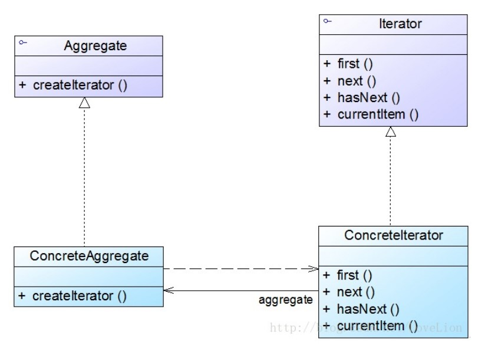
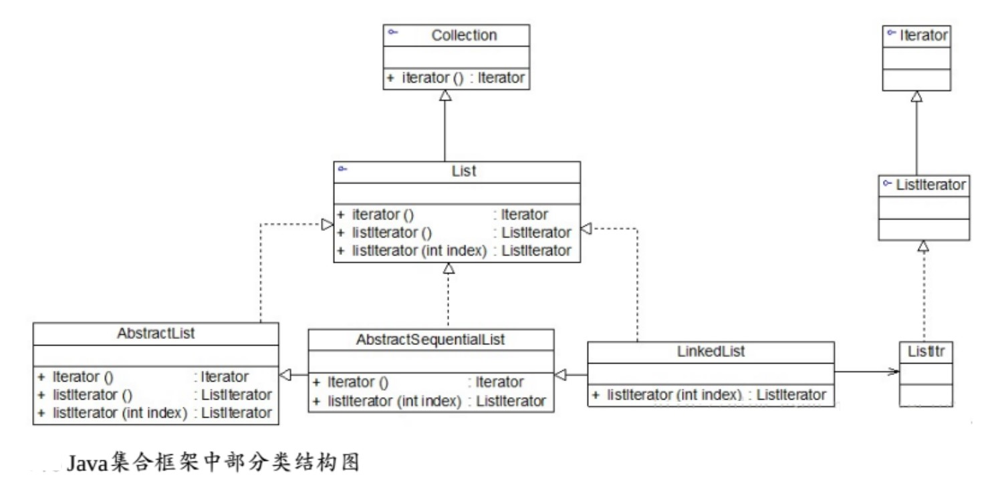

# 迭代器模式

## 一、介绍

### 1.1 定义

**迭代器模式（Iterator Pattern）**： 提供一种方法，顺序访问一个聚合对象中的各个元素，而又不暴露其内部的表示。

迭代器模式别名为**游标(Cursor)**，是一种对象行为型模式。

### 1.2 作用

迭代器模式是一种使用频率非常高的设计模式，通过引入迭代器可以将数据的遍历功能从聚合对象中分离出来，聚合对象只负责存储数据，而**遍历数据**由迭代器来完成。

### 1.3 面向对象原则

1. 开闭原则
2. 单一职责原则
3. 面向接口编程

### 1.3 使用场景

在以下情况下可以考虑使用迭代器模式：

1. 访问一个聚合对象的内容而无须暴露它的内部表示。将聚合对象的访问与内部数据的存储分离，使得访问聚合对象时无须了解其内部实现细节。

2. 需要为一个聚合对象提供多种遍历方式。

3. 为遍历不同的聚合结构提供一个统一的接口，在该接口的实现类中为不同的聚合结构提供不同的遍历方式，而客户端可以一致性地操作该接口。

### 1.4 优缺点

优点：

1. 它支持以不同的方式遍历一个聚合对象，在同一个聚合对象上可以定义多种遍历方式。在迭代器模式中只需要用一个不同的迭代器来替换原有迭代器即可改变遍历算法，我们也可以自己定义迭代器的子类以支持新的遍历方式。

2. 迭代器简化了聚合类。由于引入了迭代器，在原有的聚合对象中不需要再自行提供数据遍历等方法，这样可以简化聚合类的设计。

3. 迭代器模式中，由于引入了抽象层，增加新的聚合类和迭代器类都很方便，无须修改原有代码，满足`开闭原则`的要求。

缺点：

1. 由于迭代器模式将存储数据和遍历数据的职责分离，增加新的聚合类需要对应增加新的迭代器类，类的个数成对增加，这在一定程度上增加了系统的复杂性。

2. 抽象迭代器的设计难度较大，需要充分考虑到系统将来的扩展，例如 JDK 内置迭代器 `Iterator` 就无法实现逆向遍历，如果需要实现逆向遍历，只能通过其子类 `ListIterator` 等来实现，而 `ListIterator` 迭代器无法用于操作 `Set` 类型的聚合对象。在自定义迭代器时，创建一个考虑全面的抽象迭代器并不是件很容易的事情。

## 二、组成部分

### 2.1 UML 类图



### 2.2 角色组成

迭代器模式包含如下几个角色：

- `Iterator（抽象迭代器）`：它定义了访问和遍历元素的接口，声明了用于遍历数据元素的方法。例如：用于获取第一个元素的 `first()` 方法，用于访问下一个元素的 `next()` 方法，用于判断是否还有下一个元素的 `hasNext()` 方法，用于获取当前元素的 `currentItem()` 方法等，在具体迭代器中将实现这些方法。

- `ConcreteIterator（具体迭代器）`：它实现了抽象迭代器接口，完成对聚合对象的遍历，同时在具体迭代器中通过游标来记录在聚合对象中所处的当前位置，在具体实现时，游标通常是一个表示位置的非负整数。

- `Aggregate（抽象聚合类）`：它用于存储和管理元素对象，声明一个 `createIterator()` 方法用于创建一个迭代器对象，充当抽象迭代器工厂角色。

- `ConcreteAggregate（具体聚合类）`：它实现了在抽象聚合类中声明的 `createIterator()` 方法，该方法返回一个与该具体聚合类对应的具体迭代器 `ConcreteIterator` 实例。

### 2.3 JDK 内置迭代器

在 JDK 中，`Collection` 接口和 `Iterator` 接口充当了迭代器模式的抽象层，分别对应于**抽象聚合类**和**抽象迭代器**，而 `Collection` 接口的子类充当了**具体聚合类**，下面以 `List` 为例加以说明，下图列出了 JDK 中部分与 `List` 有关的类及它们之间的关系：



`List` 接口除了继承 `Collection` 接口的 `iterator()` 方法外，还增加了新的工厂方法 `listIterator()`，专门用于创建 `ListIterator` 类型的迭代器，在 `List` 的子类 `LinkedList` 中实现了该方法，可用于创建具体的 `ListIterator` 子类 `ListItr` 的对象，代码如下所示：

```java
public ListIterator<E> listIterator(int index) {
    return new ListItr(index);
}
```

`listIterator()` 方法用于返回具体迭代器 `ListItr` 类型的对象。在 JDK 源码中，`AbstractList` 中的 `iterator()` 方法调用了`listIterator()` 方法，如下代码所示：

```java
public Iterator iterator() {
    return listIterator();
}
```

客户端通过调用 `LinkedList` 类的 `iterator()` 方法，即可得到一个专门用于遍历 LinkedList 的迭代器对象。

大家可能会问？既然有了 `iterator()` 方法，为什么还要提供一个 `listIterator()` 方法呢？这两个方法的功能不会存在重复吗？干嘛要多此一举？

这是一个好问题。我给大家简单解释一下为什么要这样设计：由于在 `Iterator` 接口中定义的方法太少，只有三个，通过这三个方法只能实现正向遍历，而有时候我们需要对一个聚合对象进行逆向遍历等操作，因此在 JDK 的 `ListIterator` 接口中声明了用于逆向遍历的 `hasPrevious()` 和 `previous()` 等方法，如果客户端需要调用这两个方法来实现逆向遍历，就不能再使用 `iterator()` 方法来创建迭代器了，因为此时创建的迭代器对象是不具有这两个方法的。我们只能通过如下代码来创建 `ListIterator` 类型的迭代器对象：

```java
ListIterator i = c.listIterator();
```

正因为如此，在 JDK 的 `List` 接口中不得不增加对 `listIterator()` 方法的声明，该方法可以返回一个 `ListIterator` 类型的迭代器，`ListIterator` 迭代器具有更加强大的功能。

> 为什么使用 `iterator()`方法创建的迭代器无法实现逆向遍历？
> 因为 `Iterator` 接口只有正向遍历的方法，要实现逆向遍历，需要扩展接口。

## 三、示例

Rocketstar 软件公司欲开发一款第三人称射击游戏，该游戏系统需要一个逐页迭代器，每次可返回指定个数（ 一页） 元素，并将该迭代器用于对数据进行分页处理。

完整代码：[https://github.com/HasonHuang/java-design-patterns/tree/master/iterator-pattern](https://github.com/HasonHuang/java-design-patterns/tree/master/iterator-pattern)

### 3.1 抽象迭代器

- `com.hason.patterns.iterator.PageIterator`

### 3.2 具体迭代器

- `com.hason.patterns.iterator.PropResources.PropIterator` 内部迭代器

### 3.3 抽象聚合类

- `com.hason.patterns.iterator.Resources`

### 3.4 具体聚合类

- `com.hason.patterns.iterator.PropResources`

## 参考资料

1.  《Head First 设计模式》

2.  [设计模式](http://gof.quanke.name/)
