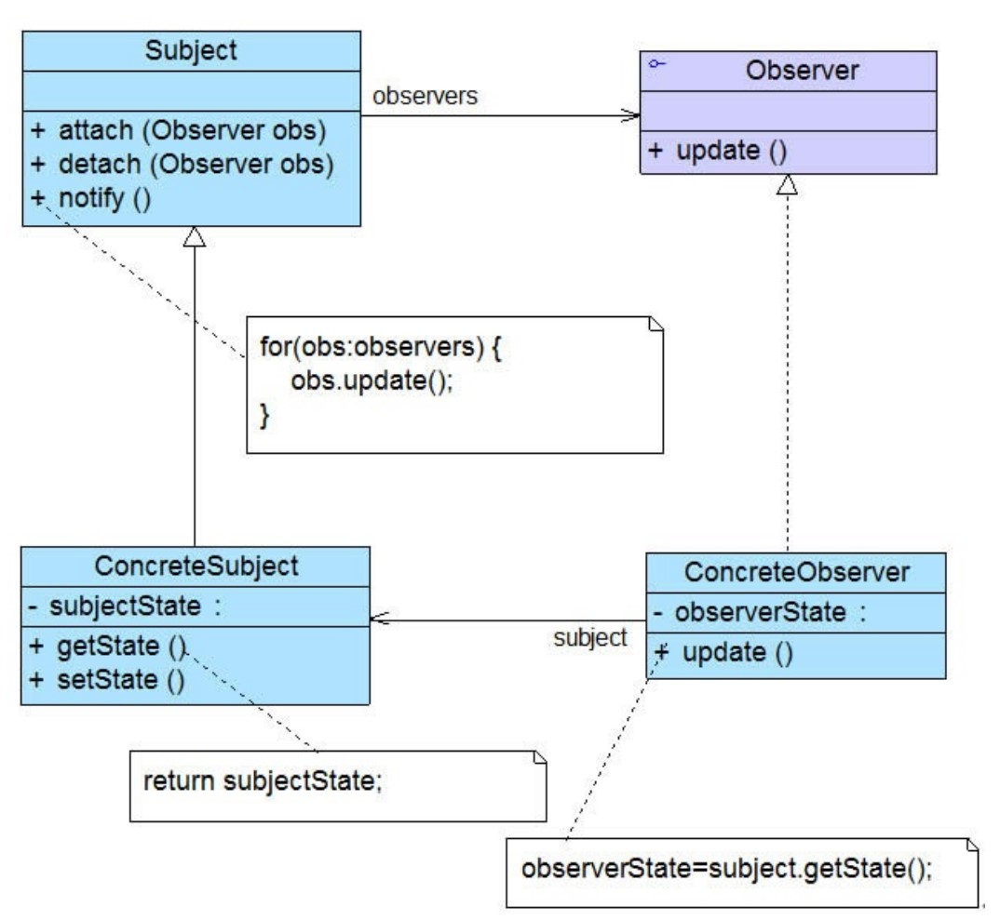
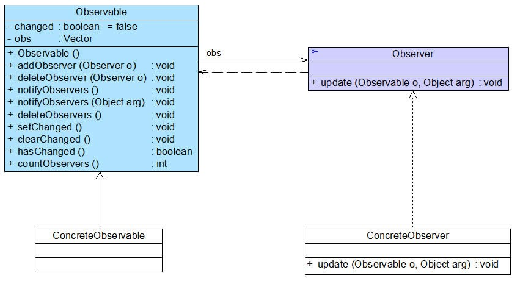

# 观察者模式

## 一、介绍

### 1.1 定义

观察者模式（Observer Pattern）：定义了对象之间的一对多依赖，这样一来，当对象改变状态时，它的所有依赖都会收到通知并自动更新。

### 1.2 作用

一个对象状态改变给其他对象通知的问题，而且要考虑到易用和低耦合，保证高度的协作。

### 1.3 使用场景

在以下情况下可以考虑使用观察者模式：

1. 一个抽象模型有两个方面，其中一个方面依赖于另一个方面，将这两个方面封装在独立的对象中使它们可以各自独立地改变和复用。

2. 一个对象的改变将导致一个或多个其他对象也发生改变，而并不知道具体有多少对象将发生改变，也不知道这些对象是谁。

3. 需要在系统中创建一个触发链，A对象的行为将影响B对象，B对象的行为将影响C对象……，可以使用观察者模式创建一种链式触发机制。

### 1.4 面向对象原则

1. 为交互对象之间的松耦合设计而努力

### 1.5 优缺点

优点：

1. 观察者模式可以实现表示层和数据逻辑层的分离，定义了稳定的消息更新传递机制，并抽象了更新接口，使得可以有各种各样不同的表示层充当具体观察者角色。

2. 观察者模式在观察目标和观察者之间建立一个抽象的耦合。观察目标只需要维持一个抽象观察者的集合，无须了解其具体观察者。由于观察目标和观察者没有紧密地耦合在一起，因此它们可以属于不同的抽象化层次。

3. 观察者模式支持广播通信，观察目标会向所有已注册的观察者对象发送通知，简化了一对多系统设计的难度。

4. 观察者模式满足“开闭原则”的要求，增加新的具体观察者无须修改原有系统代码，在具体观察者与观察目标之间不存在关联关系的情况下，增加新的观察目标也很方便。

缺点：

1. 如果一个观察目标对象有很多直接和间接观察者，将所有的观察者都通知到会花费很多时间。

2. 如果在观察者和观察目标之间存在循环依赖，观察目标会触发它们之间进行循环调用，可能导致系统崩溃。

3. 观察者模式没有相应的机制让观察者知道所观察的目标对象是怎么发生变化的，而仅仅只是知道观察目标发生了变化。

## 二、组成部分

### 2.1 UML 类图

观察者模式结构中通常包括观察目标（主题）和观察者两个继承层次结构：



### 2.2 角色组成

- `Subject（目标）` ：目标又称为主题，它是指被观察的对象。在目标中定义了一个观察者集合，一个观察目标可以接受任意数量的观察者来观察，它提供一系列方法来增加和删除观察者对象，同时它定义了通知方法 `notify()`。目标类可以是接口，也可以是抽象类或具体类。

- `ConcreteSubject（具体目标）` ：具体目标是目标类的子类，通常它包含有经常发生改变的数据，当它的状态发生改变时，向它的各个观察者发出通知；同时它还实现了在目标类中定义的抽象业务逻辑方法（如果有的话） 。如果无须扩展目标类，则具体目标类可以省略。

- `Observer（观察者）`：观察者将对观察目标的改变做出反应，观察者一般定义为接口，该接口声明了更新数据的方法 `update()`，因此又称为抽象观察者。

- `ConcreteObserver（具体观察者）`：在具体观察者中维护一个指向具体目标对象的引用，它存储具体观察者的有关状态，这些状态需要和具体目标的状态保持一致；它实现了在抽象观察者 `Observer` 中定义的 `update()` 方法。通常在实现时，可以调用具体目标类的 `attach()` 方法将自己添加到目标类的集合中或通过 `detach()` 方法将自己从目标类的集合中删除。

### 2.3 JDK 内置的观察者模式

观察者模式在 Java 语言中的地位非常重要。在 JDK 的 `java.util` 包中，提供了 `Observable` 类以及 `Observer` 接口，它们构成了 JDK 对观察者模式的支持。



#### 2.3.1 `Observer` 接口

在 `java.util.Observer` 接口中只声明一个方法，它充当抽象观察者，其方法声明代码如下所示：

```java
void  update(Observable o, Object arg);
```

当观察目标的状态发生变化时，该方法将会被调用，在 `Observer` 的子类中将实现 `update()` 方法，即具体观察者可以根据需要具有不同的更新行为。当调用观察目标类 `Observable` 的 `notifyObservers()` 方法时，将执行观察者类中的 `update()` 方法。

#### 2.3.2 `Observable` 类

`java.util.Observable` 类充当观察目标类，在 `Observable` 中定义了一个向量 `Vector` 来存储观察者对象，它所包含的方法及说明见表：

| 方法名                                         | 方法描述                                                     |
| ---------------------------------------------- | ------------------------------------------------------------ |
| Observable()                                   | 构造方法，实例化Vector向量。                                 |
| addObserver(Observer o)                        | 用于注册新的观察者对象到向量中。                             |
| deleteObserver (Observer o)                    | 用于删除向量中的某一个观察者对象。                           |
| notifyObservers()和notifyObservers(Object arg) | 通知方法，用于在方法内部循环调用向量中每一个观察者的update()方法。 |
| deleteObservers()                              | 用于清空向量，即删除向量中所有观察者对象。                   |
| setChanged()                                   | 该方法被调用后会设置一个boolean类型的内部标记变量changed的值为true，表示观察目标对象的状态发生了变化。 |
| clearChanged()                                 | 用于将changed变量的值设为false，表示对象状态不再发生改变或者已经通知了所有的观察者对象，调用了它们的update()方法。 |
| hasChanged()                                   | 用于测试对象状态是否改变。                                   |
| countObservers()                               | 用于返回向量中观察者的数量。                                 |

> `setChanged()` 方法可以让你在更新观察者时，有更多的弹性，你可以更适当地通知观察者。比如说，在对战游戏中，如果每次被击中，战队控制中心都通知队友，这可能不是我们期望的结果，我们更希望在血量损失 10% 后才通知队友，这样只在血量损失达到预期值时调用 `setChanged()` 方法，可以有效实现。

我们可以直接使用 `Observer` 接口和 `Observable` 类来作为观察者模式的抽象层，再自定义具体观察者类和具体观察目标类，通过使用JDK中的 `Observer` 接口和 `Observable` 类，可以更加方便地在 Java 语言中应用观察者模式。

## 三、示例

Sunny软件公司欲开发一款实时在线股票软件，该软件需提供如下功能：当股票购买者所 购买的某支股票价格变化幅度达到5%时，系统将自动发送通知（包括新价格） 给购买该 股票的所有股民。试使用观察者模式设计并实现该系统。

### 3.1 观察者

```java
/**
 * 股票买家（观察者，对观察目标的改变做出反应）
 *
 * @author Huanghs
 * @since 2.0
 * @date 2018/12/24
 */
public interface Buyer {

    /**
     * 接收股票数据
     *
     * @param data 股票数据
     */
    void update(StockData data);

}
```

其中 `StockData` 是通知的数据载体：

```java
/**
 * 股票数据
 *
 * @author Huanghs
 * @since 2.0
 * @date 2018/12/24
 */
@Builder
@Data
public class StockData {

    /**
     * 股票代码
     */
    private String code;
    /**
     * 当前价格
     */
    private BigDecimal price;
    /**
     * 成交量
     */
    private Long volumes;

}
```

### 3.2 目标（主题）

例子中目标是抽象类，实际上可以是一个接口。

```java
/**
 * 股票（目标，也称为主题，被观察的对象）
 *
 * @author Huanghs
 * @since 2.0
 * @date 2018/12/24
 */
public abstract class Stock {

    /**
     * 持有一个股票买家的列表
     */
    private final Set<Buyer> buyers = new CopyOnWriteArraySet<>();
    /**
     * 波幅是否大于 5%
     */
    @Getter
    private volatile boolean changed = false;

    /**
     * 购买股票（注册观察者）
     *
     * @param buyer 股票买家（观察者）
     */
    public void buy(Buyer buyer) {
        buyers.add(buyer);
    }

    /**
     * 卖出股票（注销观察者）
     *
     * @param buyer 股票买家（观察者）
     */
    public void sell(Buyer buyer) {
        buyers.remove(buyer);
    }

    /**
     * 通知股票买家，让其知道股票最新消息
     *
     * @param data 股票数据
     */
    public synchronized void notifyBuyers(StockData data) {
        if (!isChanged()) {
            // 变化幅度小于 5% 不通知
            return;
        }
        clearChanged();
        // 逐个通知买家
        buyers.forEach(buyer -> buyer.update(data));
    }

    public void setChanged() {
        changed = true;
    }

    public void clearChanged() {
        changed = false;
    }

    /**
     * 更新股票数据
     */
    public abstract void renewData(StockData data);

}
```

### 3.3 具体观察者

```java
/**
 * 程序猿股票买家（具体观察者）
 *
 * @author Huanghs
 * @since 2.0
 * @date 2018/12/24
 */
public class EngineerBuyer implements Buyer {

    /**
     * 股票代码与最后价格的关系表
     */
    private final Map<String, BigDecimal> lastPriceMap = new ConcurrentHashMap<>();

    @Override
    public void update(StockData data) {
        BigDecimal lastPrice = lastPriceMap.putIfAbsent(data.getCode(), data.getPrice());
        lastPrice = lastPrice != null ? lastPrice : BigDecimal.ZERO;
        if (lastPrice.compareTo(data.getPrice()) > 0) {
            System.out.println("程序猿：艾玛，一个月工资又没了，赶紧放掉股票：" + data.getCode());
        } else {
            System.out.println("程序猿：爽歪歪，今天赚到钱不用敲代码");
        }
    }

}
```

### 3.4 具体目标

```java
/**
 * IT股（具体的目标类）
 *
 * @author Huanghs
 * @since 2.0
 * @date 2018/12/24
 */
@AllArgsConstructor
public class ITStock extends Stock {


    /**
     * 最后一次通知买家时的股票价格，用于判断股票价格变化幅度是否大于 5%
     */
    private static volatile BigDecimal lastNotifyPrice = BigDecimal.ZERO;
    /**
     * 变化幅度
     */
    private static final BigDecimal RANGE = new BigDecimal("0.05");

    /**
     * 股票代码
     */
    private String code;

    @Override
    public void renewData(StockData data) {
        data.setCode(code);
        System.out.println("### 股市 " + code + " 报价： " + data.getPrice());
        // 只有股票变化幅度大于 5% 时才通知
        BigDecimal diff = data.getPrice().subtract(lastNotifyPrice).abs();
        if (RANGE.multiply(lastNotifyPrice).compareTo(diff) <= 0) {
            setChanged();
            lastNotifyPrice = data.getPrice();
        }
        notifyBuyers(data);
    }
}
```

### 3.5 使用模式

```java
/**
 * 市场 Demo
 *
 * @author Huanghs
 * @since 2.0
 * @date 2018/12/24
 */
public class MarketDemo {

    public static void main(String[] args) {
        // 初始化市场
        Buyer engineer = new EngineerBuyer();
        // 新股上市
        Stock it = new ITStock("IT股");
        // 向钱看
        it.buy(engineer);

        // 股市波动
        it.renewData(StockData.builder().price(new BigDecimal("10")).build());
        it.renewData(StockData.builder().price(new BigDecimal("12.00")).build());
        it.renewData(StockData.builder().price(new BigDecimal("12.05")).build());
        it.renewData(StockData.builder().price(new BigDecimal("9.90")).build());

}
```