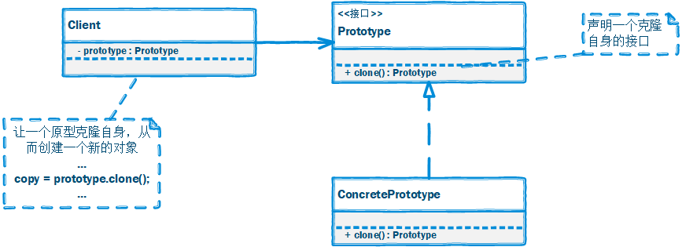
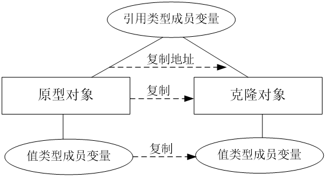
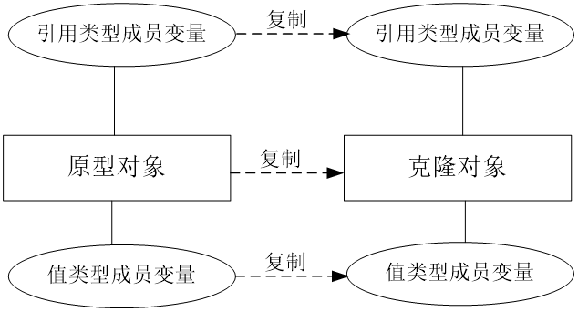
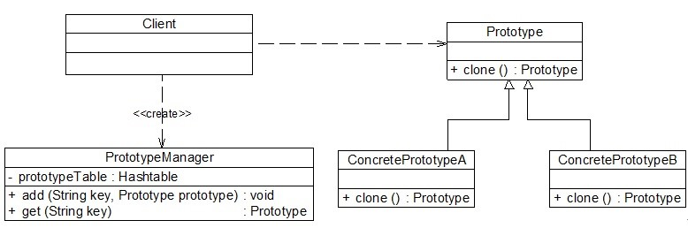

# 原型模式

## 一、介绍

### 1.1 定义

**原型模式（Prototype Pattern）**： 使用原型实例指定创建对象的种类，并且通过拷贝这些原型来创建新的对象。

原型模式是一种对象创建型模式。

### 1.2 作用

原型模式是用于创建重复的对象，同时又能保证性能。

### 1.3 面向对象原则

1. 里氏替换原则
2. 单一职责原则

### 1.3 使用场景

以下情况下可以考虑使用原型模式：

1. 创建新对象成本较大（如初始化需要占用较长的时间，占用太多的CPU资源或网络资源），新的对象可以通过原型模式对已有对象进行复制来获得，如果是相似对象，则可以对其成员变量稍作修改。

2. 如果系统要保存对象的状态，而对象的状态变化很小，或者对象本身占用内存较少时，可以使用原型模式配合备忘录模式来实现。

3. 需要避免使用分层次的工厂类来创建分层次的对象，并且类的实例对象只有一个或很少的几个组合状态，通过复制原型对象得到新实例可能比使用构造函数创建一个新实例更加方便。

### 1.4 优缺点

#### 优点

1. 当创建新的对象实例较为复杂时，使用原型模式可以简化对象的创建过程，通过复制一个已有实例可以提高新实例的创建效率。

2. 扩展性较好，由于在原型模式中提供了抽象原型类，在客户端可以针对抽象原型类进行编程，而将具体原型类写在配置文件中，增加或减少产品类对原有系统都没有任何影响。

3. 原型模式提供了简化的创建结构，工厂方法模式常常需要有一个与产品类等级结构相同的工厂等级结构，而原型模式就不需要这样，原型模式中产品的复制是通过封装在原型类中的克隆方法实现的，无须专门的工厂类来创建产品。

4. 可以使用深克隆的方式保存对象的状态，使用原型模式将对象复制一份并将其状态保存起来，以便在需要的时候使用（如恢复到某一历史状态），可辅助实现撤销操作。

#### 缺点

1. 需要为每一个类配备一个克隆方法，而且该克隆方法位于一个类的内部，当对已有的类进行改造时，需要修改源代码，违背了`开闭原则`。

2. 在实现深克隆时需要编写较为复杂的代码，而且当对象之间存在多重的嵌套引用时，为了实现深克隆，每一层对象对应的类都必须支持深克隆，实现起来可能会比较麻烦。


## 二、组成部分

### 2.1 UML 类图



### 2.2 角色组成

原型模式包含如下几个角色：

- `Prototype（抽象原型类）`：它是声明克隆方法的接口，是所有具体原型类的公共父类，可以是抽象类也可以是接口，甚至还可以是具体实现类。

- `ConcretePrototype（具体原型类）`：它实现在抽象原型类中声明的克隆方法，在克隆方法中返回自己的一个克隆对象。

- `Client（客户类）`：让一个原型对象克隆自身从而创建一个新的对象，在客户类中只需要直接实例化或通过工厂方法等方式创建一个原型对象，再通过调用该对象的克隆方法即可得到多个相同的对象。由于客户类针对抽象原型类Prototype编程，因此用户可以根据需要选择具体原型类，系统具有较好的可扩展性，增加或更换具体原型类都很方便。

### 2.3 常用的克隆方式

原型模式的核心在于如何实现克隆方法，下面将介绍两种在 Java 语言中常用的克隆实现方法：

#### 1. 通用实现方式

通用的克隆实现方法是在**具体原型类**的克隆方法中**实例化一个与自身类型相同的对象**并将其返回，并将相关的参数传入新创建的对象中，保证它们的成员属性相同。

代码如下：

```java
class ConcretePrototype implements Prototype {
    // 成员属性
    private String attr;

    public void setAttr(String attr) {
        this.attr = attr;
    }

    public String getAttr() {
        return this.attr;
    }

    // 克隆方法
    public Prototype clone() {
        // 创建新对象
        Prototype prototype = new ConcretePrototype();
        prototype.setAttr(this.attr);
        return prototype;
    }
}
```

在客户类中我们只需要创建一个ConcretePrototype对象作为原型对象，然后调用其 `clone()` 方法即可得到对应的克隆对象，如下代码所示：

```java
Prototype obj1 = new ConcretePrototype();
obj1.setAttr("Sunny");
Prototype obj2 = obj1.clone();
```

#### 2. Java 提供的 `clone()` 方法

在 Java 里，所有的类都继承自 `java.lang.Object`。事实上，`Object` 类提供一个 `clone()` 方法，可以将一个 Java 对象复制一份。因此在 Java 中可以直接使用 `Object` 提供的 `clone()` 方法来实现对象的克隆，Java 语言中的原型模式实现很简单。

需要注意的是能够实现克隆的 Java 类必须实现一个标识接口 `Cloneable`，表示这个 Java 类支持被复制。如果一个类没有实现这个接口但是调用了 `clone()` 方法，Java编译器将抛出一个 `CloneNotSupportedException` 异常。

**具体步骤**如下：

1. 在派生类中覆盖基类的clone()方法，并声明为public；

2. 在派生类的clone()方法中，调用super.clone()；

3. 派生类需实现Cloneable接口。

此时，`Object` 类相当于抽象原型类，所有实现了 `Cloneable` 接口的类相当于具体原型类。

代码如下：

```java
class ConcretePrototype implements Cloneable {
   ……
    public Prototype clone() {
        Object object = null;
        try {
            bject = super.clone();
        } catch (CloneNotSupportedException exception) {
            System.err.println("Not support cloneable");
        }
        return (Prototype) object;
    }
   ……
}
```
在客户端创建原型对象和克隆对象也很简单，如下代码所示：

```java
Prototype obj1  = new ConcretePrototype();
Prototype obj2  = obj1.clone();
```

一般而言，Java 语言中的 `clone()` 方法满足：

1. 对任何对象x，都有x.clone() != x，即克隆对象与原型对象不是同一个对象；

2. 对任何对象x，都有x.clone().getClass() == x.getClass()，即克隆对象与原型对象的类型一样；

3. 如果对象x的 equals() 方法定义恰当，那么 x.clone().equals(x) 应该成立。


### 2.4 浅克隆和深克隆

|                            |    浅克隆    | 深克隆 |
| -------------------------- | :----------: | :----: |
| 值类型                     |     复制     |  复制  |
| 引用类型                   |     复制     |  复制  |
| 原型对象（本质是引用类型） | 复制对象地址 |  复制  |

1. **浅克隆**

  简单来说，在浅克隆中，当对象被复制时只复制它本身和其中包含的值类型的成员变量，而引用类型的成员对象并没有复制。



2. **深克隆**

  简单来说，在深克隆中，除了对象本身被复制外，对象所包含的所有成员变量也将复制。



深克隆的实现方式可以参考：[Java技巧：深拷贝的两种方式](http://developer.51cto.com/art/201104/253067.htm)

### 2.5 原型管理器

**原型管理器(Prototype Manager)**是将多个原型对象存储在一个集合中供客户端使用，它是一个专门负责克隆对象的工厂，定义了一个集合用于存储原型对象，如果需要某个原型对象的一个克隆，可以通过复制集合中对应的原型对象来获得。

在原型管理器中针对**抽象原型类**进行编程，以便扩展。



## 三、示例

Rocketstar 软件公司欲开发一款第三人称射击游戏，该游戏系统里的地图资源十分繁多，为了节省硬件资源，只会加载用户 10 米以内的物体，超出距离后会销毁掉。在玩家不断地移动过程中，使用原型模式创建地图资源，以应对大量的冗余代码，同时提高性能。

例如：需要在“动物世界”这一地图中，根据用户的距离来加载各种动物。

完整代码：[https://github.com/HasonHuang/java-design-patterns/tree/master/prototype-pattern](https://github.com/HasonHuang/java-design-patterns/tree/master/prototype-pattern)

### 3.1 抽象原型

- `com.hason.patterns.prototype.MapResource`

### 3.2 具体原型

- `com.hason.patterns.prototype.AnimalMapResource`

### 3.3 原型管理器

- `com.hason.patterns.prototype.MapResourceLoader`

### 3.4 客户

- `com.hason.patterns.prototype.PrototypeTest`

## 参考资料

1.  《Head First 设计模式》

2.  [设计模式](http://gof.quanke.name/)


