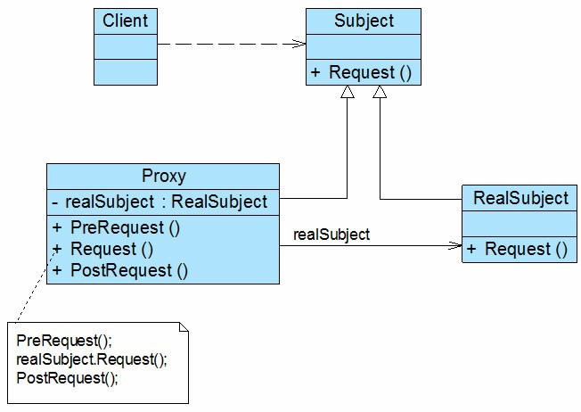
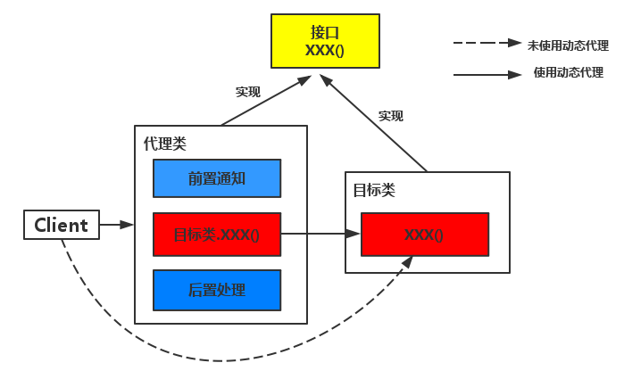
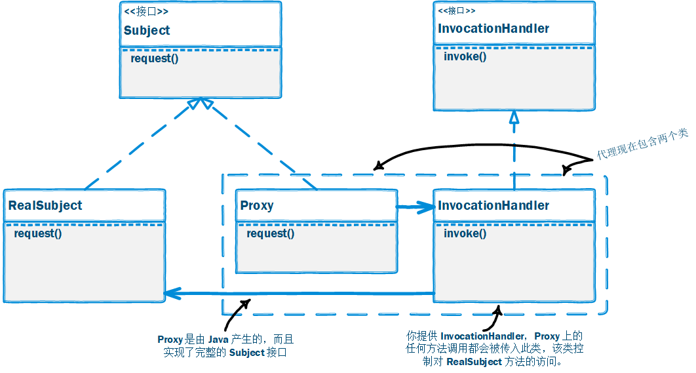

# 代理模式

## 一、介绍

### 1.1 定义

**代理模式（Proxy Pattern）**： 给某一个对象提供一个代理或占位符，并由代理对象来控制对原对象的访问。

### 1.2 作用

代理模式是常用的结构型设计模式之一，它为对象的间接访问提供了一个解决方案，可以对对象的访问进行控制。

### 1.3 面向对象原则

1. 开闭原则

### 1.3 使用场景

代理模式的类型较多，不同类型的代理模式有不同的优缺点，它们应用于不同的场合：

1. 当客户端对象需要访问远程主机中的对象时可以使用**远程代理**。

2. 当需要用一个消耗资源较少的对象来代表一个消耗资源较多的对象，从而降低系统开销、缩短运行时间时可以使用**虚拟代理**，例如一个对象需要很长时间才能完成加载时。

3. 当需要为某一个被频繁访问的操作结果提供一个临时存储空间，以供多个客户端共享访问这些结果时可以使用**缓冲代理**。通过使用缓冲代理，系统无须在客户端每一次访问时都重新执行操作，只需直接从临时缓冲区获取操作结果即可。

4. 当需要控制对一个对象的访问，为不同用户提供不同级别的访问权限时可以使用**保护代理**。

5. 当需要为一个对象的访问（引用）提供一些额外的操作时可以使用**智能引用代理**。

### 1.4 优缺点

#### 共同优点：

1. 能够协调调用者和被调用者，在一定程度上降低了系统的耦合度。

2. 客户端可以针对抽象主题角色进行编程，增加和更换代理类无须修改源代码，符合开闭原则，系统具有较好的灵活性和可扩展性。

#### 具体代理模式的优点

1. 远程代理为位于两个不同地址空间对象的访问提供了一种实现机制，可以将一些消耗资源较多的对象和操作移至性能更好的计算机上，提高系统的整体运行效率。

2. 虚拟代理通过一个消耗资源较少的对象来代表一个消耗资源较多的对象，可以在一定程度上节省系统的运行开销。

3. 缓冲代理为某一个操作的结果提供临时的缓存存储空间，以便在后续使用中能够共享这些结果，优化系统性能，缩短执行时间。

4. 保护代理可以控制对一个对象的访问权限，为不同用户提供不同级别的使用权限。

#### 缺点

1. 由于在客户端和真实主题之间增加了代理对象，因此有些类型的代理模式可能会造成请求的处理速度变慢，例如保护代理。

2. 实现代理模式需要额外的工作，而且有些代理模式的实现过程较为复杂，例如远程代理。

## 二、组成部分

### 2.1 UML 类图

### 2.2 角色组成

代理模式包含如下几个角色：

- `Subject（抽象主题角色）`：它声明了真实主题和代理主题的共同接口，这样一来在任何使用真实主题的地方都可以使用代理主题，客户端通常需要针对抽象主题角色进行编程。

- `Proxy（代理主题角色）`：它包含了对真实主题的引用，从而可以在任何时候操作真实主题对象；在代理主题角色中提供一个与真实主题角色相同的接口，以便在任何时候都可以替代真实主题；代理主题角色还可以控制对真实主题的使用，负责在需要的时候创建和删除真实主题对象，并对真实主题对象的使用加以约束。通常，在代理主题角色中，客户端在调用所引用的真实主题操作之前或之后还需要执行其他操作，而不仅仅是单纯调用真实主题对象中的操作。

- `RealSubject（真实主题角色）`：它定义了代理角色所代表的真实对象，在真实主题角色中实现了真实的业务操作，客户端可以通过代理主题角色间接调用真实主题角色中定义的操作。

### 2.3 常用的代理模式

代理模式根据其目的和实现方式不同可分为很多种类，其中常用的几种代理模式简要说明如下：

1. `远程代理(Remote Proxy)`：为一个位于不同的地址空间的对象提供一个本地的代理对象，这个不同的地址空间可以是在同一台主机中，也可是在另一台主机中，远程代理又称为大使(Ambassador)。

  例如：Java RMI

2. `虚拟代理(Virtual Proxy)`：如果需要创建一个资源消耗较大的对象，先创建一个消耗相对较小的对象来表示，真实对象只在需要时才会被真正创建。在真实对象创建成功之前虚拟代理扮演真实对象的替身，而当真实对象创建之后，虚拟代理将用户的请求转发给真实对象。

  例如：Hibernate 懒加载的实体对象

3. `保护代理(Protect Proxy)`：控制对一个对象的访问，可以给不同的用户提供不同级别的使用权限。

4. `缓冲代理(Cache Proxy)`：为某一个目标操作的结果提供临时的存储空间，以便多个客户端可以共享这些结果。

5. `智能引用代理(Smart Reference Proxy)`：当一个对象被引用时，提供一些额外的操作，例如将对象被调用的次数记录下来等。

在这些常用的代理模式中，有些代理类的设计非常复杂，例如远程代理类，它封装了底层网络通信和对远程对象的调用，其实现较为复杂。

### 2.4 静态代理和动态代理

**静态代理**：由程序员创建代理类或特定工具自动生成源代码再对其编译。在程序运行前代理类的.class文件就已经存在了。

**动态代理**：是一种运行时动态创建代理、动态处理代理方法调用的机制。在程序运行时运用反射机制动态创建而成。

例如：用来包装 RPC 调用、面向切面的编程（AOP）

实现动态代理的方式很多，常见的有：

  1. JDK 自身提供的动态代理
  2. ASM
  3. CGLIB(基于 ASM)
  4. Javassist
  5. 其他

### 2.5 JDK 动态代理

## 三、示例

Rocketstar 软件公司欲开发一款第三人称射击游戏，该游戏系统里有多种道具提供购买使用，现要求系统使用代理模式实现：购买道具时验证用户是否登录、使用道具时验证用户是否已经购买等。

完整代码：[https://github.com/HasonHuang/java-design-patterns/tree/master/proxy-pattern](https://github.com/HasonHuang/java-design-patterns/tree/master/proxy-pattern)

### 3.1 抽象主题

- `com.hason.patterns.proxy.Prop`

### 3.2 具体主题

- `com.hason.patterns.proxy.Ak47Prop`

### 3.3 代理主题

静态代理：

- `com.hason.patterns.proxy.ProxyLoginProp`
- `com.hason.patterns.proxy.ProxyOwnerProp`

动态代理：

- `com.hason.patterns.proxy.jdk.ProxyLoginInvocationHandler`
- `com.hason.patterns.proxy.jdk.ProxyOwnerInvocationHandler`

## 参考资料

1.  《Head First 设计模式》

2.  [设计模式](http://gof.quanke.name/)

