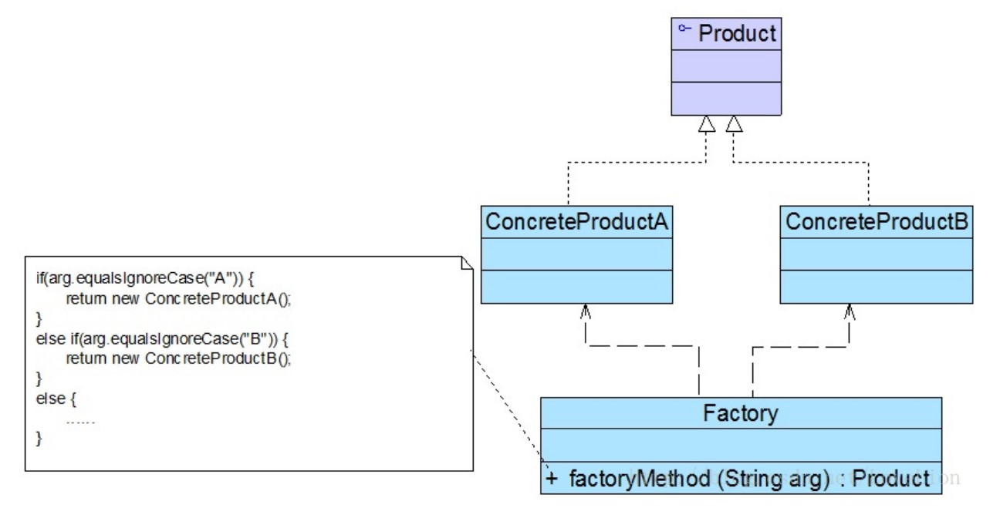

# 简单工厂模式

## 一、介绍

### 1.1 定义

简单工厂模式（Simple Factory Pattern）：定义一个工厂类，它可以根据参数的不同返回不同类的实例，被创建的实例通常都具有共同的父类。

因为在简单工厂模式中用于创建实例的方法是静态(static)方法，因此简单工厂模式又被称为静态工厂方法(Static Factory Method)模式，它属于类创建型模式。

### 1.2 作用

简单工厂模式提供了专门的工厂类用于创建对象，将对象的创建和对象的使用分离开。

### 1.3 使用场景

在以下情况下可以考虑使用简单工厂模式：

1. 工厂类负责创建的对象比较少，由于创建的对象较少，不会造成工厂方法中的业务逻辑太过复杂。

2. 客户端只知道传入工厂类的参数，对于如何创建对象并不关心。

### 1.4 面向对象原则

1.  面向接口编程

### 1.5 优缺点

优点：

1.  工厂类包含必要的判断逻辑，可以决定在什么时候创建哪一个产品类的实例，客户端可以免除直接创建产品对象的职责，而仅仅“消费”产品，简单工厂模式实现了对象创建和使用的分离。

2.  客户端无须知道所创建的具体产品类的类名，只需要知道具体产品类所对应的参数即可，对于一些复杂的类名，通过简单工厂模式可以在一定程度减少使用者的记忆量。

3.  通过引入配置文件（或常量），可以在不修改任何客户端代码的情况下更换和增加新的具体产品类，在一定程度上提高了系统的灵活性

缺点：

1. 由于工厂类集中了所有产品的创建逻辑，职责过重，一旦不能正常工作，整个系统都要受到影响。

2. 使用简单工厂模式势必会增加系统中类的个数（ 引入了新的工厂类） ，增加了系统的复杂度和理解难度。

3. 系统扩展困难，一旦添加新产品就不得不修改工厂逻辑，在产品类型较多时，有可能造成工厂逻辑过于复杂，不利于系统的扩展和维护。

4. 简单工厂模式由于使用了静态工厂方法，造成工厂角色无法形成基于继承的等级结构。

## 二、组成部分

### 2.1 UML 类图



### 2.2 角色组成

- `Factory（工厂角色）`：工厂角色即工厂类，它是简单工厂模式的核心，负责实现创建所有产品实例的内部逻辑；工厂类可以被外界直接调用，创建所需的产品对象；在工厂类中提供了静态的工厂方法 `factoryMethod()`，它的返回类型为抽象产品类型 `Product`。

- `Product（抽象产品角色）`：它是工厂类所创建的所有对象的父类，封装了各种产品对象的公有方法，它的引入将提高系统的灵活性，使得在工厂类中只需定义一个通用的工厂方法，因为所有创建的具体产品对象都是其子类对象。

- `ConcreteProduct（具体产品角色）`：它是简单工厂模式的创建目标，所有被创建的对象都充当这个角色的某个具体类的实例。每一个具体产品角色都继承了抽象产品角色，需要实现在抽象产品中声明的抽象方法。

## 三、示例

Rocketstar 软件公司欲开发一款第三人称射击游戏，该游戏系统的个性化道具种类繁多，需要用户传入参数后，生成对应的道具。

### 3.1 工厂角色

```java
/**
 * 道具的简单工厂（工厂角色）
 *
 * @author Huanghs
 * @since 2.0
 * @date 2018/12/26
 */
public class PropFactory {

    public static Prop create(PropType type) {
        switch (type) {
            case HAIR:
                return new HairProp();
            case CLOTHES:
                return new ClothesProp();
            default:
                throw new IllegalArgumentException("Unknown type:" + type);
        }
    }

}
```

### 3.2 抽象产品角色

```java
/**
 * 道具接口（抽象产品角色）
 *
 * @author Huanghs
 * @since 2.0
 * @date 2018/12/26
 */
public interface Prop {

    /**
     * 返回道具名字
     */
    String name();

}
```

```java
/**
 * 道具的类型
 *
 * @author Huanghs
 * @since 2.0
 * @date 2018/12/26
 */
public enum PropType {
    /** 发型 */
    HAIR,
    /** 衣服 */
    CLOTHES
}
```

### 3.3 具体产品角色

```java
/**
 * 衣服道具（具体产品角色）
 *
 * @author Huanghs
 * @since 2.0
 * @date 2018/12/26
 */
public class ClothesProp implements Prop {
    @Override
    public String name() {
        return "衣服道具";
    }
}
```

```java
/**
 * 发型道具（具体产品角色）
 *
 * @author Huanghs
 * @since 2.0
 * @date 2018/12/26
 */
public class HairProp implements Prop {
    @Override
    public String name() {
        return "发型道具";
    }
}
```

### 3.4 使用模式

```java
/**
 * 游戏客户端
 *
 * @author Huanghs
 * @since 2.0
 * @date 2018/12/26
 */
public class GameDemo {

    public static void main(String[] args) {
        Prop p1 = PropFactory.create(PropType.HAIR);
        System.out.println("得到：" + p1.name());
        Prop p2 = PropFactory.create(PropType.CLOTHES);
        System.out.println("得到：" + p2.name());
    }

}
```