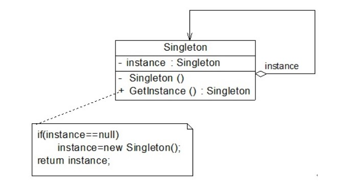

# 单例模式

## 一、介绍

### 1.1 定义

单例模式（Singleton Pattern）： 确保一个类只有一个实例，并提供一个全局访问点。

### 1.2 作用

确保一个类只有一个实例。

### 1.3 使用场景

在以下情况下可以考虑使用单例模式：

1. 系统只需要一个实例对象，如系统要求提供一个唯一的序列号生成器或资源管理器，或者需要考虑资源消耗太大而只允许创建一个对象。

2. 客户调用类的单个实例只允许使用一个公共访问点，除了该公共访问点，不能通过其他途径访问该实例。

### 1.4 面向对象原则

### 1.5 优缺点

优点：

1. 单例模式提供了对唯一实例的受控访问。因为单例类封装了它的唯一实例，所以它可以严格控制客户怎样以及何时访问它。

2. 由于在系统内存中只存在一个对象，因此可以节约系统资源，对于一些需要频繁创建和销毁的对象单例模式无疑可以提高系统的性能。

3. 允许可变数目的实例。基于单例模式我们可以进行扩展，使用与单例控制相似的方法来获得指定个数的对象实例，既节省系统资源，又解决了单例单例对象共享过多有损性能的问题。

缺点：

1. 由于单例模式中没有抽象层，因此单例类的扩展有很大的困难。

2. 单例类的职责过重，在一定程度上违背了“单一职责原则”。因为单例类既充当了工厂角色，提供了工厂方法，同时又充当了产品角色，包含一些业务方法，将产品的创建和产品的本身的功能融合到一起。

3. 现在很多面向对象语言(如Java 1.1、C#)的运行环境都提供了自动垃圾回收的技术，因此，如果实例化的共享对象长时间不被利用，系统会认为它是垃圾，会自动销毁并回收资源，下次利用时又将重新实例化，这将导致共享的单例对象状态的丢失。

## 二、组成部分

### 2.1 UML 类图

### 2.2 角色组成

- `Singleton（单例）`：在单例类的内部实现只生成一个实例，同时它提供一个静态的 `getInstance()` 工厂方法，让客户可以访问它的唯一实例；为了防止在外部对其实例化，将其构造函数设计为私有；在单例类内部定义了一个 Singleton 类型的静态对象，作为外部共享的唯一实例。

## 三、示例

Rocketstar 软件公司欲开发一款第三人称射击游戏，该游戏系统中每个用户、道具等都有一个 ID，此时需要实现一个全局 ID 生成器提供唯一的 ID。

### 3.1 单例

使用`延迟初始化占位类模式`

完整代码：[https://github.com/HasonHuang/java-design-patterns/tree/master/singleton-pattern](https://github.com/HasonHuang/java-design-patterns/tree/master/singleton-pattern)

## 参考资料

1. 《Head First 设计模式》

2. [设计模式](http://gof.quanke.name/)