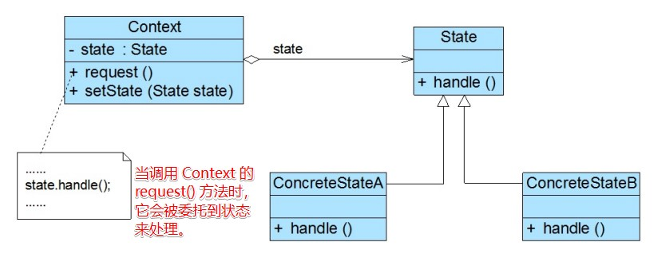

# 状态模式

## 一、介绍

### 1.1 定义

**状态模式（State Pattern）**： 允许对象在内部状态改变时改变它的行为，对象看起来好像修改了它的类。

状态模式也称为**状态对象(Objects for States)**，是一种对象行为型模式。

### 1.2 作用

状态模式将一个对象在不同状态下的不同行为封装在一个个状态类中，通过设置不同的状态对象可以让环境对象拥有不同的行为，而状态转换的细节对于客户端而言是透明的，方便了客户端的使用。

### 1.3 面向对象原则

1. 开闭原则
2. 单一职责原则
3. 多用组合

### 1.3 使用场景

在以下情况下可以考虑使用状态模式：

1. 对象的行为依赖于它的状态（如某些属性值） ，状态的改变将导致行为的变化。

2. 在代码中包含大量与对象状态有关的条件语句，这些条件语句的出现，会导致代码的可维护性和灵活性变差，不能方便地增加和删除状态，并且导致客户类与类库之间的耦合增强。

### 1.4 优缺点

优点：

1. 封装了状态的转换规则，在状态模式中可以将状态的转换代码封装在环境类或者具体状态类中，可以对状态转换代码进行集中管理，而不是分散在一个个业务方法中。

2. 将所有与某个状态有关的行为放到一个类中，只需要注入一个不同的状态对象即可使环境对象拥有不同的行为。

3. 允许状态转换逻辑与状态对象合成一体，而不是提供一个巨大的条件语句块，状态模式可以让我们避免使用庞大的条件语句来将业务方法和状态转换代码交织在一起。

4. 可以让多个环境对象共享一个状态对象，从而减少系统中对象的个数。

缺点：

1. 状态模式的使用必然会增加系统中类和对象的个数，导致系统运行开销增大。

2. 状态模式的结构与实现都较为复杂，如果使用不当将导致程序结构和代码的混乱，增加系统设计的难度。

3. 状态模式对“开闭原则”的支持并不太好，增加新的状态类需要修改那些负责状态转换的源代码，否则无法转换到新增状态；而且修改某个状态类的行为也需修改对应类的源代码。

## 二、组成部分

### 2.1 UML 类图



### 2.2 角色组成

组合模式包含如下几个角色：

- `Context（环境类）`：环境类又称为**上下文类**，它是拥有多种状态的对象。由于环境类的状态存在多样性且在不同状态下对象的行为有所不同，因此将状态独立出去形成单独的状态类。在环境类中维护一个抽象状态类 `State` 的实例，这个实例定义当前状态，在具体实现时，它是一个 `State` 子类的对象。

- `State（抽象状态类）`：它用于定义了一个所有具体状态的共同接口，以封装与环境类的一个特定状态相关的行为，任何状态都实现这个相同的接口，这样一来，状态之间可以互相替换。

- `ConcreteState（具体状态类）`：它是抽象状态类的子类，每一个子类实现一个与环境类的一个状态相关的行为，每一个具体状态类对应环境的一个具体状态，不同的具体状态类其行为有所不同。

### 2.3 状态转换的方式

在状态模式的使用过程中，一个对象的状态之间可以相互转换，通常有两种实现状态转换的方式：

1. 统一由**环境类来负责状态之间的转换**。此时，环境类还充当了**状态管理器(State Manager)**角色，在环境类的业务方法中通过对某些属性值的判断实现状态转换，还可以提供一个专门的方法用于实现属性判断和状态转换，如下代码片段所示：

  ```java
public void changeState() {
    //判断属性值，根据属性值进行状态转换
    if (value == 0) {
        this.setState(new ConcreteStateA());
    } else if (value == 1) {
        this.setState(new ConcreteStateB());
    }
}
  ```

2. 由**具体状态类来负责状态之间的转换**。可以在具体状态类的业务方法中判断环境类的某些属性值再根据情况为环境类设置新的状态对象，实现状态转换，同样，也可以提供一个专门的方法来负责属性值的判断和状态转换。此时，**状态类与环境类之间就存在依赖或关联关系**，因为状态类需要访问环境类中的属性值，如下代码片段所示：

  ```java
public void changeState(Context ctx) {
    //根据环境对象中的属性值进行状态转换
    if (ctx.getValue() == 1) {
        ctx.setState(new ConcreteStateB());
    } else if (ctx.getValue() == 2) {
        ctx.setState(new ConcreteStateC());
    }
}
  ```

> 选择哪种转换方式，实际上等于选择哪个类是对修改关闭的。

### 2.4 共享状态

在有些情况下，多个环境对象可能需要共享同一个状态，如果希望在系统中实现多个环境对象共享一个或多个状态对象，那么需要将这些状态对象定义为**环境类的静态成员对象**。

```java
public class Context {
    // 当前状态
    private static State currentState;
    // 具体状态
    private static State oneState;
    private static State otherState;
}
```

## 三、示例

Rocketstar 软件公司欲开发一款第三人称射击游戏，该游戏系统里有多种交通工具，这些交通工具在正常、故障、缺油的状态下，分别可以执行驾驶、维修、加油等动作。现在需要你使用状态模式设计一个交通工具模块。

完整代码：[https://github.com/HasonHuang/java-design-patterns/tree/master/state-pattern](https://github.com/HasonHuang/java-design-patterns/tree/master/state-pattern)

### 3.1 环境类（上下文）

- `com.hason.patterns.state.VehicleContext`

### 3.2 抽象状态类

- `com.hason.patterns.state.State`

### 3.3 具体状态类

- `com.hason.patterns.state.NormalState`
- `com.hason.patterns.state.LackState`
- `com.hason.patterns.state.FaultState`

## 参考资料

1.  《Head First 设计模式》

2.  [设计模式](http://gof.quanke.name/)


