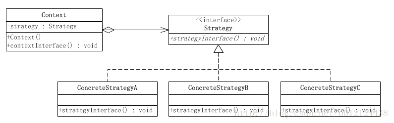

# 策略模式

## 一、介绍

### 1.1 定义

策略模式（Strategy Pattern）：定义了算法族，分别封装起来，让它们之间可以互相替换，此模式让算法的变化独立于使用算法的客户。

### 1.2 作用

主要解决在有多种算法相似的情况下，使用 if...else 所带来的复杂和难以维护。

### 1.3 使用场景

1.针对同一类型问题的多种处理方式，仅仅是具体行为有差别时；
2.需要安全地封装多种同一类型的操作时；
3.出现同一抽象类有多个子类，而又需要使用 if-else 或者 switch-case 来选择具体子类时。

### 1.4 面向对象原则

1. 封装变化
2. 多用组合，少用继承
3. 面向接口编程，而不是面向实现编程。

### 1.5 优缺点

优点：
1. 算法可以自由切换。
2. 避免使用多重条件判断。
3. 扩展性良好。

缺点：
1. 如果在一个系统里面有许多类，它们之间的区别仅在于它们的行为，那么使用策略模式可以动态地让一个对象在许多行为中选择一种行为。
2. 一个系统需要动态地在几种算法中选择一种。
3. 如果一个对象有很多的行为，如果不用恰当的模式，这些行为就只好使用多重的条件选择语句来实现。。

## 二、UML 类图



这个模式由 3 个角色组成：

1. 环境角色（`Context`）：持有一个 `Strategy` 的引用。

2. 抽象策略角色（`Strategy`）：这是一个抽象角色，通常由一个接口或抽象类实现。此角色给出所有的具体策略类所需的接口。

3. 具体策略角色（`ConcreteStrategy`）：包装了相关的算法或行为。

策略模式的典型代码如下：

### 2.1 环境角色类

```java
public class Context {
    
    //持有一个具体策略的对象
    private Strategy strategy;

    /**
     * 构造函数，传入一个具体策略对象
     *
     * @param strategy 具体策略对象
     */
    public Context(Strategy strategy) {
        this.strategy = strategy;
    }

    /**
     * 策略方法
     */
    public void contextInterface() {

        strategy.strategyInterface();
    }

}
```

### 2.2 抽象策略类

```java
public interface Strategy {
    /**
     * 策略方法
     */
    public void strategyInterface();
}
```

### 2.3 具体策略类

```java
public class ConcreteStrategyA implements Strategy {

    @Override
    public void strategyInterface() {
        //相关的业务
    }

}

​``````java
public class ConcreteStrategyB implements Strategy {

    @Override
    public void strategyInterface() {
        //相关的业务
    }

}
```

## 三、示例

假设设计一款吃鸡游戏，每名玩家拥有一把武器，但是可以随意更换武器，并且武器之间的使用不会互相影响。

### 3.1 抽象策略类

```java
/**
 * 武器的抽象类
 *
 * @author Huanghs
 * @since 2.0
 * @date 2018/12/20
 */
public interface WeaponBehavior {

    /**
     * 使用武器
     */
    void useWeapon();

}
```


### 3.2 具体策略类

假设目前仅有两把武器：匕首和手枪。

```java
/**
 * 匕首，武器的具体策略
 *
 * @author Huanghs
 * @since 2.0
 * @date 2018/12/20
 */
public class KnifeBehavior implements WeaponBehavior {

    @Override
    public void useWeapon() {
        System.out.println("匕首攻击");
    }
}
```

```java
/**
 * 枪支，武器的具体策略
 *
 * @author Huanghs
 * @since 2.0
 * @date 2018/12/20
 */
public class GunBehavior implements WeaponBehavior {

    @Override
    public void useWeapon() {
        System.out.println("枪支攻击");
    }

}
```

### 3.3 环境角色类

现在，游戏里需要一个使用武器的角色。

```java
/**
 * 吃鸡玩家，环境角色
 *
 * @author Huanghs
 * @since 2.0
 * @date 2018/12/20
 */
public class Player {

    /**
     * 每个玩家都拥有一个武器，使用组合的方式使用武器
     */
    private WeaponBehavior weaponBehavior;

    /**
     * 装备玩家的武器
     */
    public void setWeaponBehavior(WeaponBehavior weaponBehavior) {
        this.weaponBehavior = weaponBehavior;
    }

    /**
     * 玩家使用武器
     */
    public void useWeapon() {
        weaponBehavior.useWeapon();
    }
}
```

### 3.4 使用策略

现在游戏开始了，玩家在出场的时候都可以初始化一把武器。

```java
/**
 * 游戏客户端
 *
 * @author Huanghs
 * @since 2.0
 * @date 2018/12/20
 */
public class GameDemo {

    public static void main(String[] args) {
        Player player = new Player();
        // 这里随意切换武器，而无需改变其他行为
        player.setWeaponBehavior(new GunBehavior());
        // 无论更换什么武器，这里仍然不变
        player.useWeapon();
    }

}
```