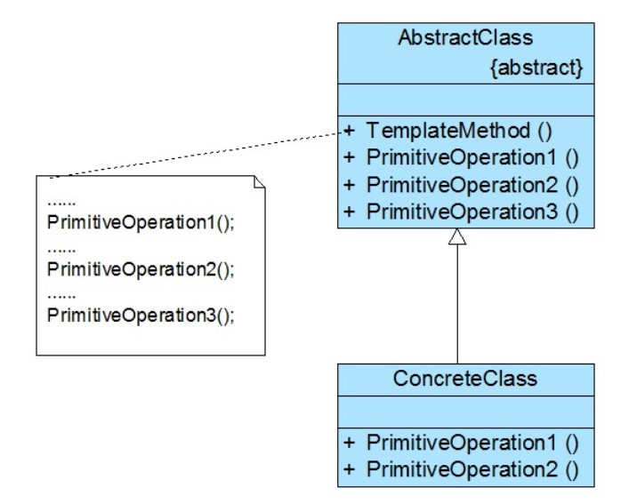

# 模板方法模式

## 一、介绍

### 1.1 定义

**模板方法模式（Template Method Pattern）**： 在一个方法中定义一个算法的骨架，而将一些步骤延迟到子类中。模板方法使得子类可以在不改变算法结构的情况下，重新定义算法中的某些步骤。

模板方法模式是一种基于继承的代码复用技术，它是一种类行为型模式。

### 1.2 作用

使用模板方法模式，可以将一些复杂流程的实现步骤封装在一系列基本方法中，在抽象父类中提供一个称之为模板方法的方法来定义这些基本方法的**执行次序**，通过其子类来覆盖某些步骤，从而使得相同的算法框架可以有**不同的执行结果**。

### 1.3 面向对象原则

1. 开闭原则
2. 单一职责原则
3. 面向接口编程
4. 好莱坞原则

### 1.3 使用场景

在以下情况下可以考虑使用模板方法模式：

1. 对一些复杂的算法进行分割，将其算法中固定不变的部分设计为模板方法和父类具体方法，而一些可以改变的细节由其子类来实现。即：一次性实现一个算法的不变部分，并将可变的行为留给子类来实现。

2. 各子类中公共的行为应被提取出来并集中到一个公共父类中以避免代码重复。

3. 需要通过子类来决定父类算法中某个步骤是否执行，实现子类对父类的反向控制。

### 1.4 优缺点

优点：

1. 在父类中形式化地定义一个算法，而由它的子类来实现细节的处理，在子类实现详细的处理算法时并不会改变算法中步骤的执行次序。

2. 模板方法模式是一种代码复用技术，它在类库设计中尤为重要，它提取了类库中的公共行为，将公共行为放在父类中，而通过其子类来实现不同的行为，它鼓励我们恰当使用继承来实现代码复用。

3. 可实现一种反向控制结构，通过子类覆盖父类的钩子方法来决定某一特定步骤是否需要执行。

4. 在模板方法模式中可以通过子类来覆盖父类的基本方法，不同的子类可以提供基本方法的不同实现，更换和增加新的子类很方便，符合单一职责原则和开闭原则。

缺点：

1. 需要为每一个基本方法的不同实现提供一个子类，如果父类中可变的基本方法太多，将会导致类的个数增加，系统更加庞大，设计也更加抽象，此时，可结合`桥接模式`来进行设计。

## 二、组成部分

### 2.1 UML 类图

### 2.2 角色组成

模板方法模式包含如下两个角色：

- `AbstractClass（抽象类）`：在抽象类中定义了一系列基本操作(PrimitiveOperations)，这些基本操作可以是具体的，也可以是抽象的，每一个基本操作对应算法的一个步骤，在其子类中可以重定义或实现这些步骤。同时，在抽象类中实现了一个模板方法(Template Method)，用于定义一个算法的框架，模板方法不仅可以调用在抽象类中实现的基本方法，也可以调用在抽象类的子类中实现的基本方法，还可以调用其他对象中的方法。

- `ConcreteClass（具体子类）`：它是抽象类的子类，用于实现在父类中声明的抽象基本操作以完成子类特定算法的步骤，也可以覆盖在父类中已经实现的具体基本操作。

### 2.3 基本方法

基本方法是实现算法各个步骤的方法，是模板方法的组成部分。基本方法又可以分为三种：

1. `抽象方法(Abstract Method)`：一个抽象方法由抽象类声明、由其具体子类实现。在 Java 语言里一个抽象方法以 `abstract` 关键字标识。

2. `具体方法(Concrete Method)`：一个具体方法由一个抽象类或具体类声明并实现，其子类可以进行覆盖也可以
直接继承。

3. `钩子方法(Hook Method)`：一个钩子方法由一个抽象类或具体类声明并实现，而其子类可能会加以扩展。通常在父类中给出的实现是一个空实现（可使用virtual关键字将其定义为虚函数） ，并以该空实现作为方法的默认实现，当然钩子方法也可以提供一个非空的默认实现。

  钩子方法有两类：

  1. 钩子方法可以与一些具体步骤“挂钩”，以实现在不同条件下执行模板方法中的不同步骤，这类钩子方法的返回类型通常是 `boolean` 类型的，这类方法名一般为 `isXXX()`，用于对某个条件进行判断，如果条件满足则执行某一步骤，否则将不执行。
  
  2. 还有一类钩子方法就是实现体为空的具体方法，子类可以根据需要覆盖或者继承这些钩子方法。好处是如果没有覆盖父类中定义的钩子方法，编译可以正常通过。

## 三、示例

Rocketstar 软件公司欲开发一款第三人称射击游戏，该游戏系统运行时需要加载各种游戏资源，比如地图、角色模型、道具模型等等。现在需要提供一个加载器，其主要流程为：读取文件、解析为可用格式（如JSON）、显示资源；而且需要支持多种文件源和数据格式。

完整代码：[https://github.com/HasonHuang/java-design-patterns/tree/master/template-method-pattern](https://github.com/HasonHuang/java-design-patterns/tree/master/template-method-pattern)

### 3.1 抽象类

- `com.hason.patterns.templatemethod.AbstractResourceLoader`

### 3.2 具体类

- `com.hason.patterns.templatemethod.MapResourceLoader`
- `com.hason.patterns.templatemethod.PropResourceLoader`

## 参考资料

1.  《Head First 设计模式》

2.  [设计模式](http://gof.quanke.name/)